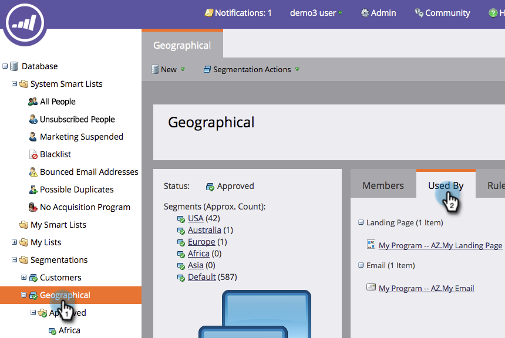

# Eliminar una segmentación {#delete-a-segmentation}

Una segmentación se puede eliminar siguiendo los pasos a continuación.

1. Ir a **[!UICONTROL Base de datos]**.

   

1. Vaya a la segmentación y haga clic en **[!UICONTROL Utilizado por]** para comprobar las asociaciones.

   

   Si otros recursos utilizan su segmentación, elimine todas esas asociaciones antes de continuar.

1. Elimine todas las asociaciones y, a continuación, en **[!UICONTROL Acciones de segmentación]**, haga clic en **[!UICONTROL Desaprobar]**.

   

   >[!NOTE]
   >
   >Puede eliminar asociaciones eliminando o creando alternativas para los recursos que utilizan la segmentación.

1. Una vez desaprobada, haga clic en **[!UICONTROL Acciones de segmentación]** y [!UICONTROL Elimine] la segmentación.

   
