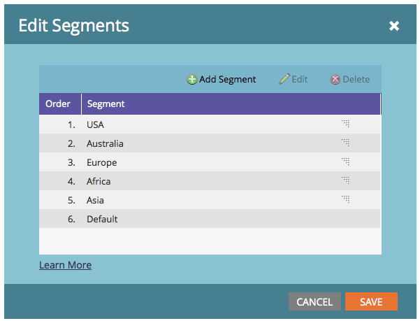

# Prioridad de orden de segmentación {#segmentation-order-priority}

Es importante comprender cómo **order** establece la prioridad para la evaluación de sus recursos en una segmentación.

>[!PREREQUISITES]
>
>[Crear una segmentación](/help/marketo/product-docs/personalization/segmentation-and-snippets/segmentation/create-a-segmentation.md)
>&#x200B;>[Definir reglas de segmentos ](/help/marketo/product-docs/personalization/segmentation-and-snippets/segmentation/define-segment-rules.md)

>[!NOTE]
>
>Solo puede editar una segmentación en modo de borrador.

1. Ir a **Base de datos**.

   

1. Seleccione su **segmentación**. En **[!UICONTROL Acciones de segmentación]**, haga clic en **[!UICONTROL Editar segmentos]**.

   

   Puede comprobar o editar el orden de los segmentos desde esta pantalla.

   

>[!NOTE]
>
>* Los segmentos son mutuamente excluyentes. Una persona solo puede ser miembro de un segmento a la vez.
>* Cuando una persona cumple los requisitos para dos segmentos, solo pertenece al primero de la lista.
>* Si una persona no cumple los requisitos para ningún segmento, se convertirá en miembro del segmento predeterminado.
