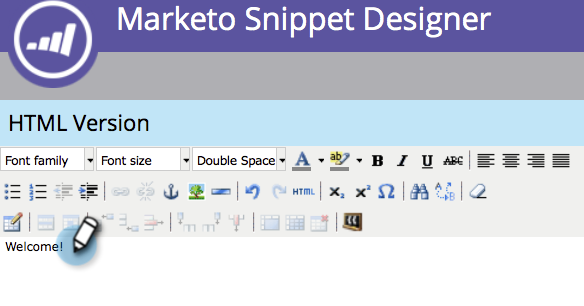

# Añadir contenido en un fragmento {#add-content-to-a-snippet}

>[!PREREQUISITES]
>
>[Creación de un fragmento](/help/marketo/product-docs/personalization/segmentation-and-snippets/snippets/create-a-snippet.md)

Puede agregar tokens, imágenes, archivos o texto enriquecido a un fragmento.

>[!NOTE]
>
>No puede incrustar ninguna sintaxis de correo electrónico [de marketing](/help/marketo/product-docs/email-marketing/general/email-editor-2/email-template-syntax.md) en fragmentos de código; **no** funcionará en un mensaje de correo electrónico. Los fragmentos solo deben ser contenido de cuerpo (HTML + TEXTO).

1. Vaya a **Design Studio**.

   

1. Seleccione el **fragmento** y haga clic en **Editar borrador**.

   

Puede agregar tres tipos de contenido a un fragmento.

## Añadir token {#add-token}

1. Arrastre y suelte el elemento **Token**.

   

1. Introduzca **Token** y haga clic en **Insertar**.

   

## Añadir imagen/archivo {#add-image-file}

1. Arrastre y suelte el elemento **Imagen/archivo**.

   

   >[!NOTE]
   >
   >Puede agregar sus propias imágenes o archivos a Marketing Cloud. Obtenga más información sobre [imágenes y archivos](/help/marketo/product-docs/demand-generation/images-and-files/add-images-and-files-to-marketo.md).

1. Seleccione la **imagen** que desee utilizar y haga clic en **Insertar**.

   

   >[!NOTE]
   >
   >También puede buscar una imagen específica si conoce su nombre.

## Añadir texto {#add-text}

1. Escriba en el área Versión HTML para agregar texto.

   

   >[!TIP]
   >
   >Utilice las herramientas de formato para personalizar el texto.

1. Para los correos electrónicos, haga clic en la ficha **Versión de texto**.

   

1. Haga clic en **Copiar desde HTML**.

   

   >[!NOTE]
   >
   >Las imágenes, los vínculos y el formato se eliminan en la versión de texto.

¡Genial! Ahora puede crear una variedad de contenido para su fragmento.

>[!MORELIKETHIS]
>
>* [Previsualización de un fragmento](/help/marketo/product-docs/personalization/segmentation-and-snippets/snippets/preview-a-snippet.md)
>* [Aprobar un fragmento](/help/marketo/product-docs/personalization/segmentation-and-snippets/snippets/approve-a-snippet.md)

