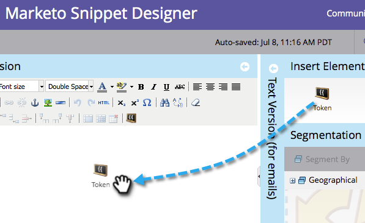

# Añadir contenido a un fragmento {#add-content-to-a-snippet}

>[!PREREQUISITES]
>
>[Crear un fragmento](/help/marketo/product-docs/personalization/segmentation-and-snippets/snippets/create-a-snippet.md)

Puede agregar tokens, imágenes, archivos o texto enriquecido a un fragmento.

>[!NOTE]
>
>No puede incrustar ninguna [Sintaxis del correo electrónico de Marketo](/help/marketo/product-docs/email-marketing/general/email-editor-2/email-template-syntax.md) en fragmentos; it **not** trabajar en un correo electrónico. Los fragmentos solo deben ser contenido del cuerpo (HTML + TEXTO).

1. Vaya a la **Design Studio**.

   

1. Seleccione su **Fragmento** y haga clic en **Editar borrador**.

   

Puede añadir tres tipos de contenido a un fragmento.

## Añadir token {#add-token}

1. Arrastre y suelte la **Token** elemento.

   

1. Entrar **Token** y haga clic en **Insertar**.

   

## Agregar imagen/archivo {#add-image-file}

1. Arrastre y suelte la **Imagen/Archivo** elemento.

   

   >[!NOTE]
   >
   >Puede añadir sus propias imágenes o archivos a Marketo. Más información sobre [imágenes y archivos](/help/marketo/product-docs/demand-generation/images-and-files/add-images-and-files-to-marketo.md).

1. Seleccione el **Imagen** para utilizar y haga clic en **Insertar**.

   

   >[!NOTE]
   >
   >También puede buscar una imagen específica si conoce su nombre.

## Agregar texto {#add-text}

1. Escriba en el área Versión del HTML para agregar texto.

   

   >[!TIP]
   >
   >Utilice las herramientas de formato para personalizar el texto.

1. Para los correos electrónicos, haga clic en el botón **Versión de texto** pestaña .

   

1. Haga clic en **Copiar desde el HTML**.

   

   >[!NOTE]
   >
   >Las imágenes, los vínculos y el formato se eliminan en la versión de texto.

¡Genial! Ahora puede crear una variedad de contenido para su fragmento.

>[!MORELIKETHIS]
>
>* [Vista previa de un fragmento](/help/marketo/product-docs/personalization/segmentation-and-snippets/snippets/preview-a-snippet.md)
>* [Aprobar un fragmento](/help/marketo/product-docs/personalization/segmentation-and-snippets/snippets/approve-a-snippet.md)

