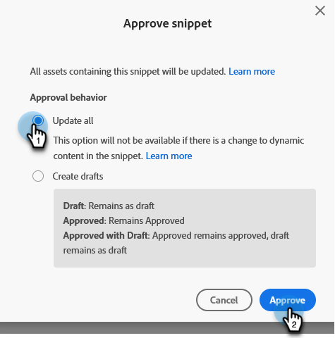

# Aprobar un fragmento sin borrador {#approve-a-snippet-with-no-draft}

## Aprobar el fragmento {#approve-the-snippet}

La opción Sin borrador se activa cada vez que se aprueba un fragmento. Esto incluye un fragmento de código compartido o referenciado por recursos de otros espacios de trabajo.

1. Vaya a **[!UICONTROL Design Studio]**.

   

1. Busque y seleccione el fragmento deseado.

   

1. En la lista desplegable **[!UICONTROL Acciones de fragmento]**, elija **[!UICONTROL Aprobar borrador]**.

   

1. Seleccione una opción en el cuadro de diálogo Aprobar fragmento y haga clic en **[!UICONTROL Aprobar]**:

   * **[!UICONTROL Actualizar todo]**: esta opción no creará borradores de los recursos aprobados mediante el fragmento. Todos los recursos reciben las actualizaciones y mantienen sus estados anteriores. Aparece un módulo de progreso en la parte superior derecha de la pantalla; se puede cerrar en cualquier momento. Para restaurarlo, haga clic con el botón derecho en el nombre del fragmento y seleccione Mostrar estado de aprobación.
   * **[!UICONTROL Crear borradores]**: esta opción creará borradores de los recursos aprobados utilizando el fragmento. Seleccione esta opción si primero deben revisarse los cambios de fragmento. Todos los borradores deben aprobarse manualmente.

   

   >[!NOTE]
   >
   >Para un nuevo fragmento de código que aún no se ha utilizado, esta pantalla Aprobar borrador no aparece. Se muestra cuando el fragmento se utiliza en uno o varios recursos.

>[!CAUTION]
>
>Esta función está diseñada para ahorrar tiempo con el flujo de trabajo de aprobación de fragmentos. Sin embargo, hay que tener en cuenta algunas limitaciones. Consulte [este artículo](https://nation.marketo.com/t5/knowledgebase/no-draft-snippet-limitations-and-troubleshooting/ta-p/300799){target="_blank"} para obtener detalles.

>[!MORELIKETHIS]
>
>[Habilitar la opción sin borrador para fragmentos](/help/marketo/product-docs/administration/users-and-roles/enable-no-draft-for-snippets.md){target="_blank"}
