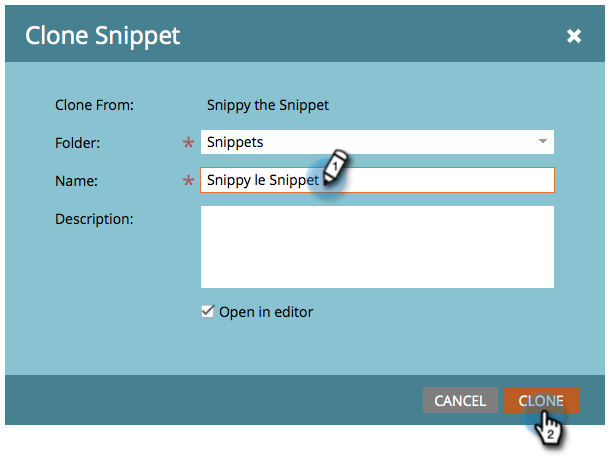

# Clonar un fragmento {#clone-a-snippet}

Clona un fragmento para crear una copia de él que puedas modificar según tus necesidades.

1. Vaya a **Design Studio**.

   

1. Vaya a su fragmento y, a continuación, en **Acciones de fragmento**, haga clic en **Clonar**.

   

1. Introduzca los detalles del fragmento y haga clic en **Clonar**.

   

¡Increíble! Ahora puede modificar el fragmento clonado para adaptarlo a sus necesidades.

>[!MORELIKETHIS]
>
>[Editar fragmentos con contenido dinámico](/help/marketo/product-docs/personalization/segmentation-and-snippets/snippets/edit-snippets-with-dynamic-content.md)
