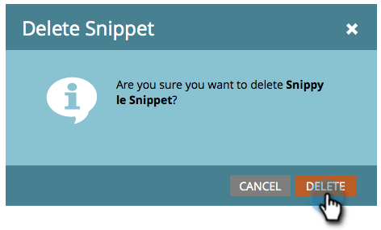

# Eliminar un fragmento {#delete-a-snippet}

>[!PREREQUISITES]
>
>[Desaprobar un fragmento](/help/marketo/product-docs/personalization/segmentation-and-snippets/snippets/unapprove-a-snippet.md)

Elimine un fragmento de código que ya no necesite.

1. Vaya a **Design Studio**.

   

1. Vaya al fragmento y, a continuación, en **Acciones de fragmento**, haga clic en **Eliminar**.

   

1. Haz clic en **Eliminar** para confirmar o simplemente **Cancelar**.

   

   >[!NOTE]
   >
   >Solo puede eliminar un fragmento que no esté aprobado y que no utilice ningún recurso.

¡Listo! No puede recuperarlo, por lo que debe asegurarse de hacer clic en el botón Eliminar.
