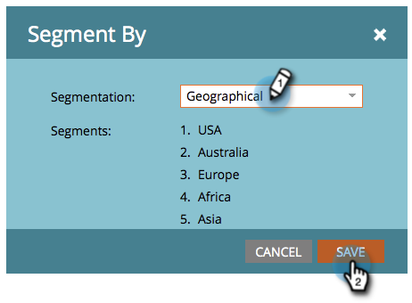

# Editar recortes con contenido dinámico {#edit-snippets-with-dynamic-content}

>[!PREREQUISITES]
>
>* [Crear una segmentación](/help/marketo/product-docs/personalization/segmentation-and-snippets/segmentation/create-a-segmentation.md)
>* [Crear un fragmento](/help/marketo/product-docs/personalization/segmentation-and-snippets/snippets/create-a-snippet.md)

Utilice la segmentación en fragmentos para administrar fácilmente el contenido dinámico de los correos electrónicos y las páginas de aterrizaje.

## Añadir segmentación {#add-segmentation}

1. Vaya a la **Design Studio**.

   

1. Haga clic en su **Fragmento** y luego **Editar borrador**.

   

1. Haga clic en **Segmentar por**.

   

1. Entrar **Segmentación** y haga clic en **Guardar**.

   

## Aplicar contenido dinámico {#apply-dynamic-content}

1. Haga clic en un **Segmento** y, a continuación, edite el contenido. Repetir para cada segmento

   

>[!NOTE]
>
>Recuerde aprobar el fragmento antes de utilizarlo.

¿No era tan simple? Ahora todos están configurados para utilizar estos fragmentos en correos electrónicos y páginas de aterrizaje.

>[!MORELIKETHIS]
>
>* [Añadir un fragmento de código a un correo electrónico](/help/marketo/product-docs/email-marketing/general/functions-in-the-editor/add-a-snippet-to-an-email.md)
>* [Agregar un fragmento a una página de aterrizaje](/help/marketo/product-docs/demand-generation/landing-pages/personalizing-landing-pages/add-a-snippet-to-a-landing-page.md)

