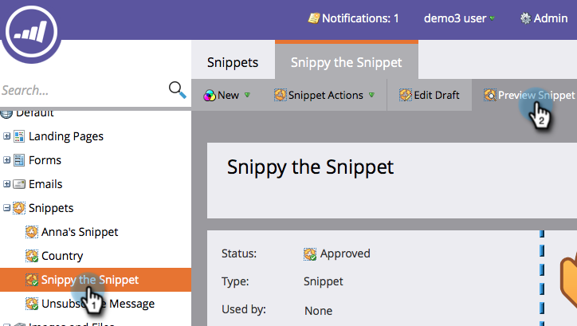

# Previsualizar un fragmento {#preview-a-snippet}

>[!PREREQUISITES]
>
>[Agregar contenido a un fragmento](/help/marketo/product-docs/personalization/segmentation-and-snippets/snippets/add-content-to-a-snippet.md)

Los fragmentos de código son bloques de contenido dinámico que cambian según las reglas de segmentación.

1. Vaya a **[!UICONTROL Design Studio]**.

   

1. Haga clic en el fragmento y, a continuación, **[!UICONTROL Previsualizar fragmento]**.

   

La vista previa es excelente para asegurarse de que el contenido tenga el aspecto adecuado para cada segmento.

>[!MORELIKETHIS]
>
>[Aprobar un fragmento](/help/marketo/product-docs/personalization/segmentation-and-snippets/snippets/approve-a-snippet.md)
