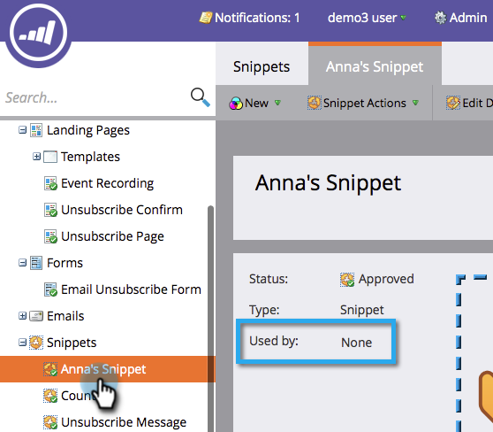

# Desaprobar un fragmento {#unapprove-a-snippet}

Un fragmento sin aprobar no se puede usar en correos electrónicos ni en páginas de aterrizaje.

1. Vaya a la **Design Studio**.

   

1. Vaya a su fragmento y asegúrese de que no **Utilizado por** cualquier recurso.

   

   Si el fragmento lo utilizan otros recursos, elimine esas asociaciones antes de continuar.

1. En **Acciones de fragmento**, haga clic en **Desaprobar**.

   

¡Eso es todo! El fragmento está en estado de borrador ahora para que realice cambios o lo elimine.
