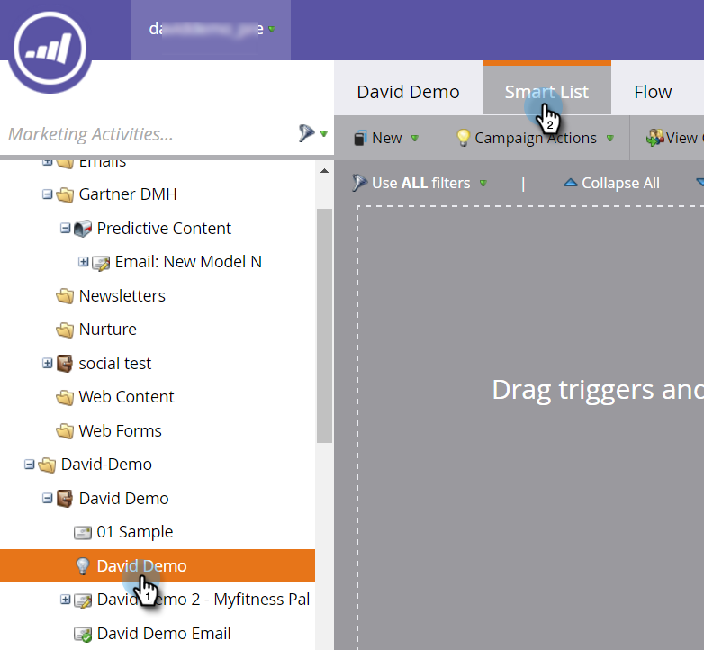

# Definir una Lista inteligente para Actividades de contenido predictivo {#define-a-smart-list-for-predictive-content-activities}

Puede utilizar actividades de contenido predictivo en déclencheur y filtros cuando defina una lista inteligente en una campaña inteligente. Puede déclencheur de una acción para cualquiera que haga clic en contenido predictivo mediante la [plantilla de medios enriquecidos](/help/marketo/product-docs/predictive-content/enabling-predictive-content/enable-predictive-content-for-web-rich-media.md), la [barra de recomendaciones de contenido](/help/marketo/product-docs/predictive-content/enabling-predictive-content/enable-the-content-recommendation-bar.md) o en un [correo electrónico](/help/marketo/product-docs/predictive-content/enabling-predictive-content/enable-predictive-content-in-emails.md).

1. En la campaña inteligente, navegue a la ficha **Lista inteligente**.

   

   >[!NOTE]
   >
   >Las listas inteligentes pueden hacer cosas increíbles. Obtenga más información en el [buceo profundo de lista inteligente](/help/marketo/product-docs/core-marketo-concepts/smart-campaigns/understanding-smart-campaigns.md).

1. Busque el déclencheur y arrástrelo y suéltelo en el lienzo.

   

   >[!NOTE]
   >
   >Una campaña inteligente con déclencheur se ejecuta en modo Déclencheur. Funciona de una persona a la vez en función de los eventos activados y los filtros agregados.

1. Haga clic en la lista desplegable **Nombre** y seleccione un operador.

   

1. Defina el déclencheur.

   

1. Añada la restricción **Type**.

   

1. Seleccione el origen que necesita para la lista inteligente.

   

1. Si está utilizando el origen de correo electrónico para el contenido predictivo, agregue el déclencheur **Clicks Link en Email**. Seleccione el correo electrónico y agregue la restricción **Es predictivo**, definida como **true**.

   

1. Añada cualquier otro filtros según sea necesario.

   

   >[!TIP]
   >
   >En una campaña inteligente con déclencheur y filtros, los déclencheur van en la parte superior. Cuando se activa, solo las personas que cumplen los criterios del filtro atraviesan el flujo.

   >[!NOTE]
   >
   >Con múltiples déclencheur, una persona pasa al flujo si ALGUNO de los déclencheur se activa.

   Para ejecutar la campaña en un conjunto de personas al mismo tiempo, aprenda a [definir una lista inteligente para una campaña inteligente por lotes](/help/marketo/product-docs/core-marketo-concepts/smart-campaigns/creating-a-smart-campaign/define-smart-list-for-smart-campaign-batch.md).

   >[!MORELIKETHIS]
   >
   >* [Definir Lista inteligente para Campaña inteligente | Lote](/help/marketo/product-docs/core-marketo-concepts/smart-campaigns/creating-a-smart-campaign/define-smart-list-for-smart-campaign-batch.md)
   >* [Añadir un paso de flujo en una Campaña inteligente](/help/marketo/product-docs/core-marketo-concepts/smart-campaigns/flow-actions/add-a-flow-step-to-a-smart-campaign.md)
   >* [Definir una Lista inteligente para Actividades de personalización web](/help/marketo/product-docs/web-personalization/working-with-web-campaigns/define-a-smart-list-for-web-personalization-activities.md)
   >* [Habilitar contenido predictivo para medios enriquecidos por Web](/help/marketo/product-docs/predictive-content/enabling-predictive-content/enable-predictive-content-for-web-rich-media.md)
   >* [Habilitar la barra de recomendaciones de contenido](/help/marketo/product-docs/predictive-content/enabling-predictive-content/enable-the-content-recommendation-bar.md)

