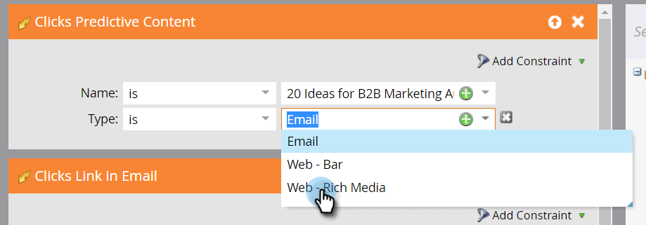

# Definir una lista inteligente para actividades de contenido predictivo {#define-a-smart-list-for-predictive-content-activities}

Las actividades de contenido predictivo se pueden usar en déclencheur y filtros cuando se define una lista inteligente en una campaña inteligente. Puede crear un déclencheur de una acción para cualquier persona que haga clic en contenido predictivo mediante la variable [Plantilla de medios enriquecidos](/help/marketo/product-docs/predictive-content/enabling-predictive-content/enable-predictive-content-for-web-rich-media.md), el [Barra de recomendaciones de contenido](/help/marketo/product-docs/predictive-content/enabling-predictive-content/enable-the-content-recommendation-bar.md)o en un [email](/help/marketo/product-docs/predictive-content/enabling-predictive-content/enable-predictive-content-in-emails.md).

1. En la campaña inteligente, vaya a la **Lista inteligente** pestaña .

   

   >[!NOTE]
   >
   >Las listas inteligentes pueden hacer cosas sorprendentes. Obtenga más información en la [análisis profundo de listas inteligentes](/help/marketo/product-docs/core-marketo-concepts/smart-campaigns/understanding-smart-campaigns.md).

1. Busque el déclencheur y, a continuación, arrástrelo y suéltelo en el lienzo.

   

   >[!NOTE]
   >
   >Una campaña inteligente con déclencheur se ejecuta en modo de Déclencheur. Se ejecuta de una persona a la vez en función de los eventos activados y los filtros añadidos.

1. Haga clic en el **Nombre** y seleccione un operador.

   

1. Defina el déclencheur.

   

1. Agregue la variable **Tipo** restricción.

   

1. Seleccione el origen que necesita para la lista inteligente.

   

1. Si está utilizando la fuente de correo electrónico para el contenido predictivo, agregue la variable **Vínculo de clics en correo electrónico** déclencheur. Seleccione su correo electrónico y añada la variable **Es predictivo** restricción, definida como **true**.

   

1. Agregue otros filtros según sea necesario.

   

   >[!TIP]
   >
   >En una campaña inteligente con déclencheur y filtros, los déclencheur van en la parte superior. Cuando se activa, solo las personas que satisfacen los criterios de filtro pasan por el flujo.

   >[!NOTE]
   >
   >Con varios déclencheur, una persona va al flujo si se activa CUALQUIERA de los déclencheur.

   Para ejecutar la campaña en un conjunto de personas al mismo tiempo, aprenda a [definir una lista inteligente para una campaña inteligente por lotes](/help/marketo/product-docs/core-marketo-concepts/smart-campaigns/creating-a-smart-campaign/define-smart-list-for-smart-campaign-batch.md).

   >[!MORELIKETHIS]
   >
   >* [Definición de la lista inteligente para campañas inteligentes | Lote](/help/marketo/product-docs/core-marketo-concepts/smart-campaigns/creating-a-smart-campaign/define-smart-list-for-smart-campaign-batch.md)
   >* [Adición de un paso de flujo a una campaña inteligente](/help/marketo/product-docs/core-marketo-concepts/smart-campaigns/flow-actions/add-a-flow-step-to-a-smart-campaign.md)
   >* [Definir una lista inteligente para actividades de personalización web](/help/marketo/product-docs/web-personalization/working-with-web-campaigns/define-a-smart-list-for-web-personalization-activities.md)
   >* [Habilitar contenido predictivo para medios enriquecidos en la Web](/help/marketo/product-docs/predictive-content/enabling-predictive-content/enable-predictive-content-for-web-rich-media.md)
   >* [Habilitar la barra de recomendaciones de contenido](/help/marketo/product-docs/predictive-content/enabling-predictive-content/enable-the-content-recommendation-bar.md)

