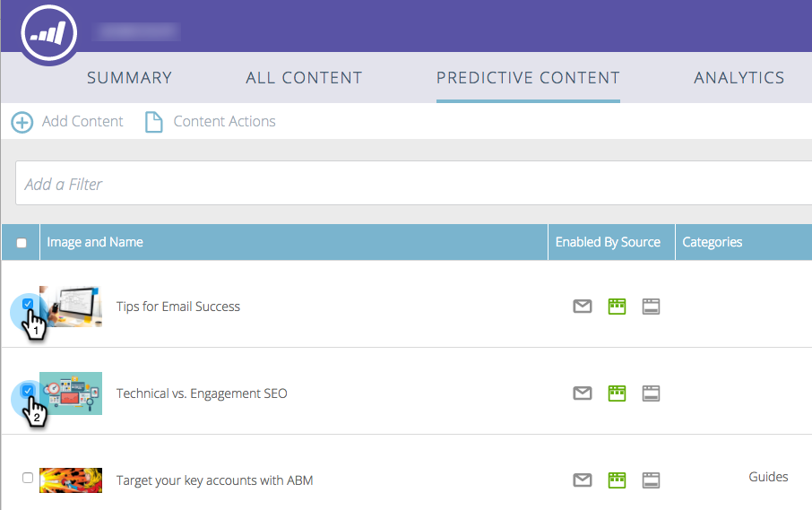

# Habilitar contenido predictivo para medios enriquecidos por Web {#enable-predictive-content-for-web-rich-media}

El contenido predictivo atrae a los visitantes web con el contenido más relevante, gracias al aprendizaje automático y a los análisis predictivos. Con los medios enriquecidos en la Web, puede mejorar el contenido con descripciones e imágenes de texto e incrustar varias recomendaciones de contenido predictivo en el sitio Web.

>[!PREREQUISITES]
>
>Antes de habilitar el contenido predictivo, debe:
>
>* [Preparación del contenido predictivo](https://docs.marketo.com/display/docs/edit+predictive+content)
>* [Aprobar un título para contenido predictivo](/help/marketo/product-docs/predictive-content/working-with-all-content/approve-a-title-for-predictive-content.md)

>

Una vez que haya preparado el título, la descripción y la imagen del contenido para los medios enriquecidos, puede activar fragmentos de contenido individuales o múltiples.

1. Para habilitar un título individual, haga clic en un título para abrir el editor. Haga clic en Medios enriquecidos, luego marque la casilla **Habilitado para contenido predictivo en medios enriquecidos** y haga clic en **Guardar**.

   

1. Para varios fragmentos de contenido, en la página **Contenido predictivo**, marque las casillas junto a los títulos.

   

1. Haga clic en la lista desplegable **Acciones de contenido** y seleccione **Habilitar para medios enriquecidos en Web**.

   |

## Personalice el código Javascript e introdúzcalo en su sitio Web {#customize-the-javascript-code-and-embed-it-into-your-website}

Consulte la documentación de la plantilla de recomendación de medios enriquecidos [en el sitio Desarrolladores de marketing.](https://developers.marketo.com/documentation/websites/rtp-rich-media-recommendations-api)Esto explica cómo personalizar la plantilla para el sitio web.

Pegue el código JavaScript en el sitio web en la ubicación donde desee que aparezca la plantilla.

**Ejemplos de plantillas**

* Plantilla1: Tres fragmentos de contenido horizontal con imágenes, encabezado y descripción
* Plantilla2: Tres fragmentos de contenido vertical con imágenes, encabezado y descripción

Este es un ejemplo de la plantilla de recomendación de medios enriquecidos1:

Este es un ejemplo de la plantilla de recomendación de medios enriquecidos2:

>[!MORELIKETHIS]
>
>* [Habilitar la barra de recomendaciones de contenido](enable-the-content-recommendation-bar.md)
>* [Habilitar contenido predictivo en correos electrónicos](https://docs.marketo.com/x/vLit)

