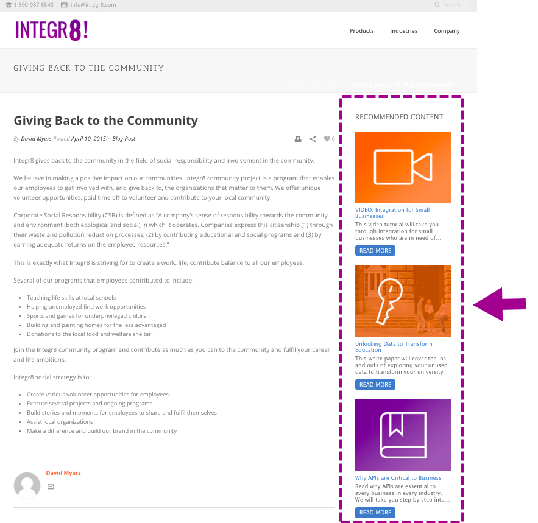

# Habilitar contenido predictivo para medios enriquecidos en web {#enable-predictive-content-for-web-rich-media}

El contenido predictivo atrae a los visitantes web con el contenido más relevante, impulsado por el aprendizaje automático y el análisis predictivo. Con Web Rich Media, puede mejorar su contenido con descripciones de texto e imágenes e incrustar varias recomendaciones de contenido predictivo en su sitio web.

>[!NOTE]
>
>Se recomienda habilitar más de cinco fragmentos de contenido por categoría y por fuente (correo electrónico, medios enriquecidos, barra) antes de probar y utilizar el contenido predictivo. Más contenido le ofrece un mejor resultado predictivo.

>[!PREREQUISITES]
>
>Antes de activar Contenido predictivo, debe:
>
>* **Preparación del contenido predictivo**
>
>   * [Editar contenido predictivo para correos electrónicos](/help/marketo/product-docs/predictive-content/working-with-predictive-content/edit-predictive-content-for-emails.md){target="_blank"} o
>   * [Editar contenido predictivo para medios enriquecidos](/help/marketo/product-docs/predictive-content/working-with-predictive-content/edit-predictive-content-for-rich-media.md){target="_blank"} o
>   * [Editar contenido predictivo para la barra de recomendaciones](/help/marketo/product-docs/predictive-content/working-with-predictive-content/edit-predictive-content-for-the-recommendation-bar.md){target="_blank"}
>
>* [Aprobar un título para contenido predictivo](/help/marketo/product-docs/predictive-content/working-with-all-content/approve-a-title-for-predictive-content.md){target="_blank"}

Una vez que haya preparado el título, la descripción y la imagen del contenido para Rich Media, puede habilitar fragmentos de contenido individuales o múltiples.

1. Para habilitar un título individual, haga clic en un título para abrir el editor. Haga clic en Rich Media y, a continuación, marque **Habilitado para contenido predictivo en medios enriquecidos** y haga clic en **Guardar**.

   

1. Para varios fragmentos de contenido, en la **Contenido predictivo** , marque las casillas junto a los títulos.

   

1. Haga clic en **Acciones de contenido** y seleccione. **Habilitar para medios enriquecidos en web**.

   |

## Personalice el código JavaScript e incrústelo en su sitio web  {#customize-the-javascript-code-and-embed-it-into-your-website}

Consulte la documentación de la plantilla Recomendación de medios enriquecidos [en el sitio para desarrolladores de Marketo](https://experienceleague.adobe.com/en/docs/marketo-developer/marketo/javascriptapi/rich-media-recommendation){target="_blank"}. Esto explica cómo personalizar la plantilla para el sitio web.

Pegue el código JavaScript en el sitio web, en la ubicación donde desee que aparezca la plantilla.

**Ejemplos de plantillas**

* Plantilla1: tres partes de contenido horizontales con imágenes, encabezado y descripción
* Plantilla 2: Tres fragmentos de contenido vertical con imágenes, encabezado y descripción

Este es un ejemplo de la plantilla de recomendación de medios enriquecidos1:

Este es un ejemplo de la plantilla de recomendación de medios enriquecidos2:

