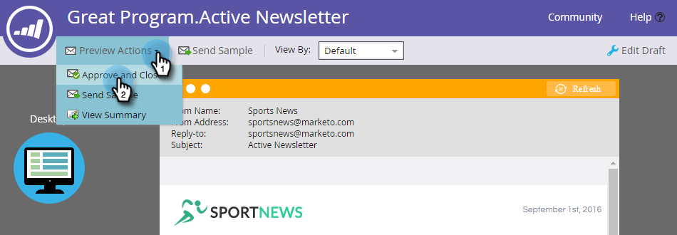

# Habilitar contenido predictivo en correos electrónicos {#enable-predictive-content-in-emails}

Consiga que una o más imágenes de su correo electrónico sean predictivas y adapte la experiencia para cada destinatario.

>[!NOTE]
>
>Se recomienda habilitar más de cinco fragmentos de contenido por categoría y por fuente (correo electrónico, medios enriquecidos, barra) antes de probar y usar Contenido predictivo. Más contenido le ofrece un mejor resultado predictivo.

>[!PREREQUISITES]
>
>Antes de activar el contenido predictivo, debe:
>
>* **Prepare su contenido predictivo**
   >
   >   * [Editar contenido predictivo para correos electrónicos](/help/marketo/product-docs/predictive-content/working-with-predictive-content/edit-predictive-content-for-emails.md){target=&quot;_blank&quot;} o
   >   * [Editar contenido predictivo para medios enriquecidos](/help/marketo/product-docs/predictive-content/working-with-predictive-content/edit-predictive-content-for-rich-media.md){target=&quot;_blank&quot;} o
   >   * [Editar contenido predictivo para la barra de recomendaciones](/help/marketo/product-docs/predictive-content/working-with-predictive-content/edit-predictive-content-for-the-recommendation-bar.md){target=&quot;_blank&quot;}
>
>* [Aprobar un título para contenido predictivo](/help/marketo/product-docs/predictive-content/working-with-all-content/approve-a-title-for-predictive-content.md){target=&quot;_blank&quot;}


## Adición de contenido predictivo con el editor de correo electrónico 2.0 {#adding-predictive-content-using-the-email-editor}

1. Haga clic en **Actividades de marketing**.

   

1. Seleccione el correo electrónico y haga clic en **Editar borrador**.

   

1. Haga clic en la imagen que desee hacer predictiva. Cuando aparezca el icono de engranaje, haga clic en él y seleccione **Habilitar ContentAI** (ContentAI es el nombre anterior para el contenido predictivo).

   

1. Para seleccionar una o más categorías, haga clic en el botón **Categorías** , realice la selección y haga clic en **Aplicar**.

   

   >[!NOTE]
   >
   >Es opcional elegir categorías específicas o cambiar el diseño predictivo.

1. La imagen ahora es predictiva. Repita los pasos 3 y 4 para imágenes adicionales (si lo desea).

   

1. Para obtener una vista previa del correo electrónico, haga clic en **Vista previa** en la esquina superior derecha.

   

1. Para ver diferentes imágenes posibles, haga clic en **Actualizar**.

   

   >[!NOTE]
   >
   >La imagen no está seleccionada **_hasta que el destinatario abra el correo electrónico_**. Así que lo que ve en la vista previa es solo un ejemplo, y no necesariamente es la imagen que ve el destinatario.

1. Una vez que haya terminado de previsualizar el correo electrónico, haga clic en el botón **Vista previa de acciones** y seleccione **Aprobar y cerrar**. O si todavía tiene que editar, haga clic en **Editar borrador** a la derecha.

   

   >[!NOTE]
   >
   >Al enviar una muestra, se selecciona una imagen aleatoria.

Después de aprobar el correo electrónico, estará equipado con contenido predictivo y listo para enviarlo.

>[!CAUTION]
>
>Una vez que un destinatario abre el correo electrónico, las imágenes predictivas se bloquean. Si el contenido se elimina más tarde, los destinatarios verán una imagen rota donde el contenido estaba.

## Adición de contenido predictivo al no usar el editor de correo electrónico 2.0 {#adding-predictive-content-when-not-using-the-email-editor}

Si no utiliza un [Correo electrónico 2.0](/help/marketo/product-docs/email-marketing/general/email-editor-2/email-editor-v2-0-overview.md)La plantilla {target=&quot;_blank&quot;}, agregar contenido predictivo al correo electrónico se puede hacer simplemente etiquetando una imagen en la plantilla como elemento de imagen editable de Marketo.

Obtenga información sobre [Sintaxis específica de Marketo aquí](/help/marketo/product-docs/email-marketing/general/email-editor-2/email-template-syntax.md#elements){target=&quot;_blank&quot;}.

Este es un ejemplo de cómo debería ser el código (este es solo un ejemplo, no copie el código siguiente exactamente).

**Ejemplo**

```example
<div class="mktoImg" id="exampleImg" mktoName="Example Image" mktoImgLink="https://www.marketo.com">  
<a></a>  
</div>
```
