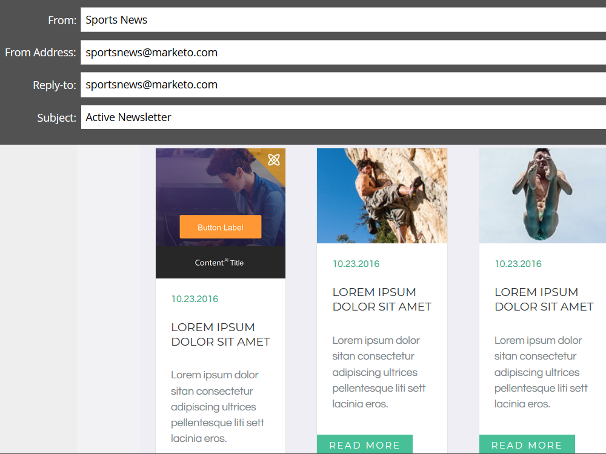

# Habilitar contenido predictivo en correos electrónicos {#enable-predictive-content-in-emails}

Haga predictivas una o más imágenes en el correo electrónico, lo que personalizará la experiencia de cada destinatario.

>[!NOTE]
>
>Se recomienda activar más de cinco fragmentos de contenido por categoría y por fuente (correo electrónico, medios enriquecidos, barra) antes de probar y usar contenido predictivo. Más contenido le ofrece un mejor resultado predictivo.

>[!PREREQUISITES]
>
>Antes de habilitar el contenido predictivo, debe:
>
>* **Preparación del contenido predictivo**
   >
   >   
   * [Editar contenido predictivo para el ](/help/marketo/product-docs/predictive-content/working-with-predictive-content/edit-predictive-content-for-emails.md) remitente
   >   * [Editar contenido predictivo para ](/help/marketo/product-docs/predictive-content/working-with-predictive-content/edit-predictive-content-for-rich-media.md) medios enriquecidos
   >   * [Editar contenido predictivo para la barra de recomendaciones](/help/marketo/product-docs/predictive-content/working-with-predictive-content/edit-predictive-content-for-the-recommendation-bar.md)
>
>* [Aprobar un título para contenido predictivo](/help/marketo/product-docs/predictive-content/working-with-all-content/approve-a-title-for-predictive-content.md)


## Añadir contenido predictivo con el Editor de correo electrónico 2.0 {#adding-predictive-content-using-the-email-editor}

1. Haga clic en **Actividades de mercadotecnia**.

   

1. Seleccione su correo electrónico y haga clic en **Editar borrador**.

   

1. Haga clic en la imagen que desee hacer predictiva. Cuando aparezca el icono de engranaje, haga clic en él y seleccione **Habilitar ContentAI** (ContentAI es el nombre anterior para Contenido predictivo).

   

1. Para seleccionar una o varias categorías, haga clic en la lista desplegable **Categorías**, realice la selección y haga clic en **Aplicar**.

   

   >[!NOTE]
   >
   >La selección de categorías específicas o el cambio del diseño predictivo son opcionales.

1. La imagen ahora es predictiva. Repita los pasos 3 y 4 para imágenes adicionales (si lo desea).

   

1. Para previsualización de su correo electrónico, haga clic en **Previsualización** en la esquina superior derecha.

   

1. Para vista de diferentes imágenes posibles, haga clic en **Actualizar**.

   

   >[!NOTE]
   >
   >La imagen no se selecciona **_hasta que el destinatario abre el correo electrónico_**. Lo que ven en la previsualización es sólo un ejemplo, y no necesariamente la imagen que ve el destinatario.

1. Una vez que haya terminado de obtener la vista previa del correo electrónico, haga clic en la lista desplegable **Acciones de Previsualización** y seleccione **Aprobar y cerrar**. O si todavía tiene que editar, haga clic en **Editar borrador** a la derecha.

   

   >[!NOTE]
   >
   >Al enviar una muestra, se seleccionará una imagen aleatoria.

Después de aprobar su correo electrónico, estará equipado con Contenido predictivo y listo para enviar!

>[!CAUTION]
>
>Una vez que un destinatario abre el correo electrónico, las imágenes predictivas se bloquean. Si posteriormente se elimina el contenido, los destinatarios verán una imagen rota donde estaba el contenido.

## Añadir contenido predictivo cuando no se utiliza el editor de correo electrónico 2.0 {#adding-predictive-content-when-not-using-the-email-editor}

Si no utiliza una plantilla [Email 2.0](/help/marketo/product-docs/email-marketing/general/email-editor-2/email-editor-v2-0-overview.md), puede agregar contenido predictivo al correo electrónico simplemente etiquetando una imagen en la plantilla como elemento de imagen editable de Marketing to.

Obtenga más información sobre la sintaxis [específica del marketing aquí](/help/marketo/product-docs/email-marketing/general/email-editor-2/email-template-syntax.md#elements).

A continuación se muestra un ejemplo de cómo debería verse el código (este es sólo un ejemplo, no copie el código siguiente exactamente).

**Ejemplo**

```example
<div class="mktoImg" id="exampleImg" mktoName="Example Image" mktoImgLink="https://www.marketo.com">  
<a></a>  
</div>
```
