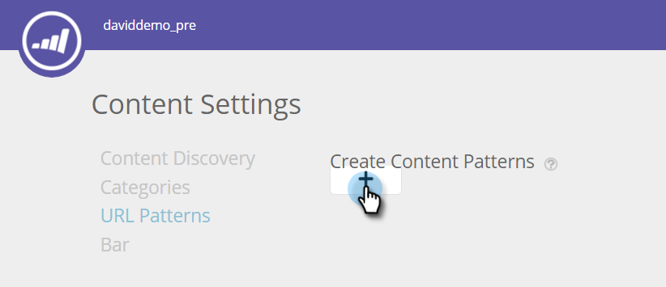
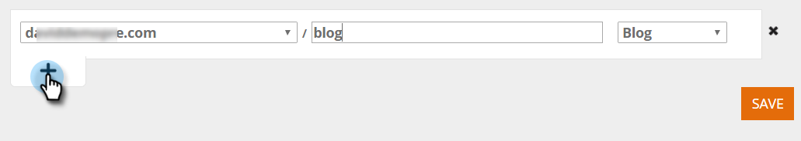
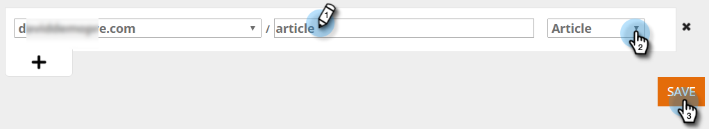

# Crear patrones de contenido {#create-content-patterns}

Al establecer patrones de contenido, el contenido se descubre automáticamente cuando un visitante web hace clic en la página web HTML relevante para el patrón de contenido. Se utiliza para agregar páginas HTML (anuncios de blog, comunicados de prensa, artículos de noticias) como artículos de contenido a la página Todo el contenido. Cuando el descubrimiento automático se basa en patrones de contenido, detecta y rastrea páginas HTML relacionadas con el patrón de URL definido cuando un visitante web vista o hace clic en un vínculo a la página. Esta parte de contenido (la dirección URL, el nombre de página y los metadatos, incluida la dirección URL de la imagen y la descripción) se agrega a la página Todo el contenido para preparar contenido predictivo. Para descubrir automáticamente otro contenido, como archivos PDF y vídeos incrustados, debe [habilitar la detección de contenido](/help/marketo/product-docs/predictive-content/getting-started/enable-content-discovery.md).

1. Vaya a **Configuración de contenido**.

   

1. Haga clic en **Patrones de URL**.

   

1. Haga clic en **+** para abrir una fila en la que puede introducir la información.

   

1. Añada la extensión URL del dominio donde existe la página web. Seleccione la categoría (por ejemplo, Blog, Artículo, Hoja de datos, Comunicado de prensa).

   

   >[!NOTE]
   >
   >Los elementos de la lista desplegable de la derecha reflejan las categorías que configuró cuando [creó categorías](/help/marketo/product-docs/predictive-content/getting-started/set-up-categories.md).

1. Haga clic en **+** para agregar otra ruta.

   

1. Añada la extensión y la categoría de la ruta adicional y haga clic en **Guardar**.

   

## Reglas de patrón de contenido {#content-pattern-rules}

* Puede utilizar un comodín en cualquier lugar de una expresión (ejemplo: _domain.com/*_, _domain.com/*blog*_)

* Se recomienda utilizar /* al final de una expresión para continuar la detección de patrones (Ejemplo: _domain.com/blog/*_ detecta todos los anuncios de la carpeta Blog)
* Los patrones de contenido no distinguen entre mayúsculas y minúsculas (ejemplo: _domain.com/Blog/*_ detecta todas las páginas html en _domain.com/Blog_ y _domain.com/blog_)

* No se detectan parámetros de URL (esto evita el descubrimiento de varios elementos con la misma dirección URL de contenido pero parámetros diferentes)

## Ejemplos {#examples}

Para _domain.com_:

<table> 
 <tbody> 
  <tr> 
   <th>Patrón de dirección URL</th> 
   <th>Resultado</th> 
  </tr> 
  <tr> 
   <td>blog/*</td> 
   <td>
Descubre todo el contenido que coincide con el patrón domain.com/blog/:

domain.com/blog/5-top-tricks

domain.com/blog/2017/new-year-solutions

domain.com/Blog/3-best-recipes
</td> 
  </tr> 
  <tr> 
   <td>artículo/2017/7</td> 
   <td>
Descubre todo el contenido que coincide con el patrón domain.com/article/2017/:

domain.com/article/2017/5-top-tricks
</td> 
  </tr> 
  <tr> 
   <td></td> 
   <td>
Descubre cualquier dirección URL que contenga la palabra "hojas de datos:"

domain.com/datasheets/5-top-tricks

domain.com/blog/5-top-datasheets
</td> 
  </tr> 
  <tr> 
   <td>comunicado de prensa</td> 
   <td>
Solo se detecta una página HTML de coincidencia exacta:

domain.com/press-release
</td> 
  </tr> 
  <tr> 
   <td colspan="1"> </td> 
   <td colspan="1">
Si la expresión de URL está vacía, el patrón de URL solo detecta la página de inicio:

domain.com
</td> 
  </tr> 
 </tbody> 
</table>
