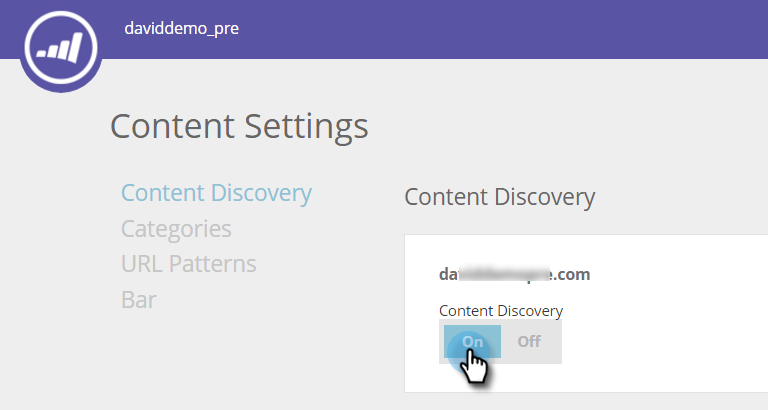

# Habilitar detección de contenido {#enable-content-discovery}

La función de detección de contenido detecta y etiqueta automáticamente el contenido ya existente (incluidos casos prácticos, publicaciones de blog, vídeos, comunicados de prensa, etc.) desde el sitio web y realiza un seguimiento de la cantidad de vistas de estos materiales.  El contenido predictivo utiliza el contenido descubierto, empleando análisis predictivos para determinar cuál es el contenido de mayor rendimiento y recomienda el mejor contenido a la persona adecuada.

1. Vaya a **[!UICONTROL Configuración de contenido]**.

   

1. Active [!UICONTROL Detección de contenido] a **[!UICONTROL Activado]**.

   

Si establece [!UICONTROL Descubrimiento de contenido] en [!UICONTROL Activado], se descubrirá automáticamente un contenido de PDF o vídeo cuando cualquier visitante web haga clic en el archivo o vea el vídeo. Este fragmento de contenido (URL, nombre de contenido y URL de imagen) se añade y luego se rastrea en la página Todo el contenido. Cuando se detecta automáticamente un vídeo, lo descubrimos cuando un visitante web hace clic y ve un vídeo incrustado desde YouTube, [!DNL Vimeo] o [!DNL Wistia]. Para descubrir automáticamente otro contenido, necesitaría [crear patrones de contenido](/help/marketo/product-docs/predictive-content/getting-started/create-content-patterns.md).
