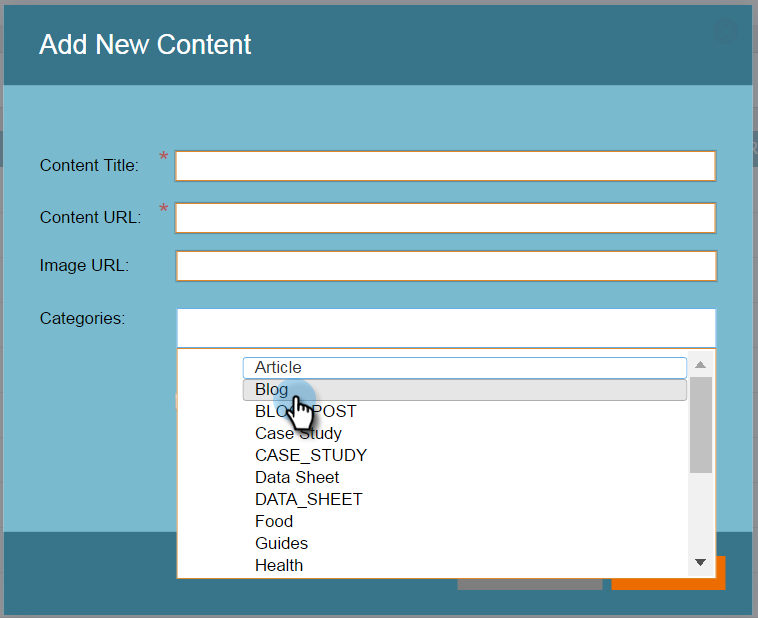

# Configurar categorías {#set-up-categories}

Cree categorías en Contenido predictivo para agrupar los resultados predictivos en la web o por correo electrónico. Por ejemplo, solo puede trabajar con blogs o con contenido en un idioma concreto. También le permite buscar y filtrar la vista de página.  Las categorías se muestran en las páginas [!UICONTROL Todo el contenido] y [!UICONTROL Contenido predictivo] para facilitar la referencia.

Cuando edite el contenido detectado, añada categorías en la pantalla de edición. Haga clic en el campo **[!UICONTROL Categorías]** y selecciónelas en la lista desplegable.

Al agregar contenido, puede etiquetarlo con categorías seleccionadas en la ventana emergente.

## Crear etiquetas de categoría {#create-category-tags}

A continuación se indica cómo crear etiquetas de categoría.

1. Vaya a **[!UICONTROL Configuración de contenido]**.

   

1. Haga clic en **[!UICONTROL Categorías]**.

   

1. Se muestran las etiquetas de categoría existentes. Escriba una etiqueta de categoría nueva y haga clic en **[!UICONTROL Crear nuevo]**.

   

1. Para quitar una etiqueta de categoría, haz clic en **x** junto a ella.

   

1. Haz clic en **[!UICONTROL Guardar]** cuando hayas terminado.

   

   Bastante simple.
