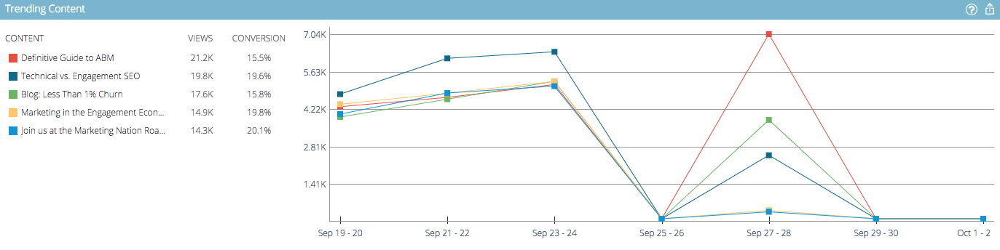

# Información general de análisis de contenido predictivo {#predictive-content-analytics-overview}

Utilice el análisis de contenido para obtener más información sobre el contenido existente, conocer (según algoritmos de AI y predictivos) qué contenido funciona para sus audiencias y aumentar el ROI de sus esfuerzos de mercadotecnia.

>[!NOTE]
>
>La ficha Análisis y las funciones de análisis de contenido están disponibles exclusivamente con Contenido predictivo de marketing.

## Información general {#overview}

En la página Resumen, haga clic en **Analytics**.

Analytics comprende varias secciones: Contenido principal por Vistas, Contenido principal por Tasa de conversión, Contenido de tendencias, Contenido sugerido y Contenido.

Pase el ratón sobre el signo de interrogación en cualquier encabezado de sección para obtener más detalles.

Haga clic en el botón Exportar para exportar los resultados de esa sección a través de Excel.

Puede filtrar los resultados por varios atributos/propiedades (por ejemplo: Lista de cuenta ABM, País, etc.).

Haga clic en el icono de calendario para cambiar las fechas de los datos reflejados. Elija una cantidad de tiempo preestablecida o un intervalo de fechas específico.

## Contenido principal por Vistas {#top-content-by-views}

Muestra los fragmentos de contenido principales por número de vistas por intervalo de fechas seleccionado.

## Contenido principal por Tasa de conversión {#top-content-by-conversion-rate}

Muestra el contenido de mayor conversión por tasa de conversión para el intervalo de fechas seleccionado.

>[!NOTE]
>
>**Definición**
>
>**tasa de conversión**: Un porcentaje calculado mediante conversiones directas divididas por clics.

## Tendencias del contenido {#trending-content}

Muestra el aumento de popularidad de un fragmento de contenido observando el aumento de vistas de las dos últimas semanas en comparación con el mismo período anterior.

## Contenido sugerido {#suggested-content}

Muestra el contenido que le sugerimos promocionar en sus Actividades de marketing según el filtro que haya definido.

Pase el ratón sobre una imagen en Contenido sugerido para mostrar las opciones disponibles.

>[!NOTE]
>
>¿Ven esos iconos en la parte inferior? De izquierda a derecha son: Vista de contenido, Exportar a CSV, Aprobar contenido.

## Contenido {#content}

Busque la parte de contenido deseada y haga clic en ella para ver detalles adicionales, como: los visitantes que lo ven, nuevos versus reincidentes, conocidos y anónimos, las ubicaciones principales de las que provienen los visitantes al ver el contenido y las industrias de las que provienen.

>[!NOTE]
>
>El contenido similar se basa en la parte de contenido seleccionada y se calcula mediante un algoritmo de reglas de asociación. Los resultados representan las partes de contenido en las que los visitantes harán clic con mayor probabilidad, en función de la pieza seleccionada y del comportamiento de visitante anterior. No tiene en cuenta el filtro o el intervalo de fechas.
