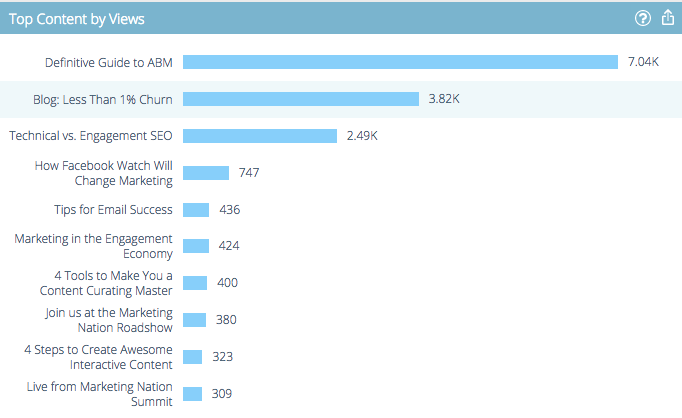

# Información general de Predictive Content Analytics {#predictive-content-analytics-overview}

Utilice el análisis de contenido para obtener más información sobre el contenido existente, conocer (en función de los algoritmos de IA y predicción) qué contenido funciona para sus audiencias y aumentar el ROI de sus esfuerzos de marketing.

>[!NOTE]
>
>Las funciones de análisis de contenido y fichas de Analytics están disponibles exclusivamente con Contenido predictivo de Marketo.

## Resumen {#overview}

En la página Resumen, haga clic en **Analytics**.

Analytics consta de varias secciones: Contenido principal por vistas, Contenido principal por tasa de conversión, Contenido de tendencias, Contenido sugerido y Contenido.

Pase el ratón sobre el signo de interrogación en el encabezado de cualquier sección para obtener más información.

Haga clic en el botón de exportación para exportar los resultados de esa sección a través de Excel.

Puede filtrar los resultados por distintos atributos/propiedades (por ejemplo, ABM Account List, Country, etc.).

Haga clic en el icono de calendario para cambiar las fechas de los datos reflejados. Elija una cantidad de tiempo preestablecida o un intervalo de fechas específico.

## Contenido principal por vistas {#top-content-by-views}

Muestra los elementos de contenido principales por número de vistas por intervalo de fechas seleccionado.

## Contenido principal por tasa de conversión {#top-content-by-conversion-rate}

Muestra el contenido de mayor conversión según la tasa de conversión del intervalo de fechas seleccionado.

>[!NOTE]
>
>**Definición**
>
>**Tasa de conversión**: Un porcentaje calculado mediante conversiones directas divididas por clics.

## Tendencias de contenido {#trending-content}

Muestra el aumento de popularidad de una pieza de contenido observando el aumento de vistas de las dos últimas semanas en comparación con el mismo periodo anterior.

## Contenido sugerido {#suggested-content}

Muestra el contenido que le sugerimos promocionar en sus actividades de marketing según el filtro que haya definido.

Pase el ratón sobre una imagen en Contenido sugerido para mostrar las opciones disponibles.

>[!NOTE]
>
>¿Ves esos iconos en la parte inferior? De izquierda a derecha son: Ver contenido, Exportar a CSV y Aprobar contenido.

## Contenido {#content}

Busque la parte de contenido deseada y haga clic en ella para ver detalles adicionales, como: los visitantes que lo ven, nuevos frente a los que regresan, conocidos y anónimos, las principales ubicaciones de las que salieron los visitantes al ver el contenido y las principales industrias de las que proceden.

>[!NOTE]
>
>El contenido similar se basa en la parte de contenido seleccionada y se calcula mediante un algoritmo de reglas de asociación. Los resultados representan fragmentos de contenido en los que los visitantes probablemente harán clic, según la pieza seleccionada y el comportamiento de los visitantes anteriores. No tiene en cuenta el filtro o el intervalo de fechas.
