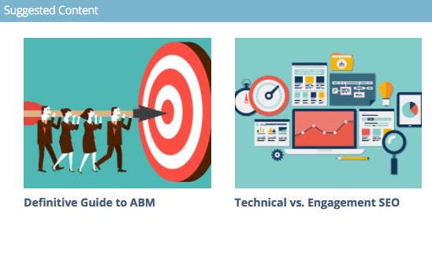

# Información general de análisis de contenido predictivo {#predictive-content-analytics-overview}

Utilice el análisis de contenido para obtener más información sobre el contenido existente, conozca (en función de la IA y los algoritmos predictivos) qué contenido funciona para sus audiencias y aumente el retorno de la inversión de sus esfuerzos de marketing.

>[!NOTE]
>
>Las funciones de análisis de contenido y pestaña de Analytics solo están disponibles con Predictive Content de Marketo.

## Información general {#overview}

En la página Resumen, haga clic en **Analytics**.

Analytics consta de varias secciones: Contenido principal por vistas, Contenido principal por tasa de conversión, Contenido de tendencias, Contenido sugerido y Contenido.

Pase el ratón sobre el signo de interrogación del encabezado de cualquier sección para obtener más información.

Haga clic en el botón exportar para exportar los resultados de esa sección a través de Excel.

Puede filtrar los resultados por varios atributos o propiedades (por ejemplo: Lista de cuentas ABM, País, etc.).

Haga clic en el icono de calendario para cambiar las fechas de los datos reflejados. Elija una cantidad de tiempo preestablecida o un intervalo de fecha específico.

## Contenido principal por vistas {#top-content-by-views}

Muestra los fragmentos de contenido principales por número de vistas según el intervalo de fechas seleccionado.

## Contenido principal por tasa de conversión {#top-content-by-conversion-rate}

Muestra el contenido de conversión principal por tasa de conversión para el intervalo de fechas seleccionado.

>[!NOTE]
>
>**Definición**
>
>**Tasa de conversión**: Un porcentaje calculado por conversiones directas dividido por clics.

## Contenido de tendencias {#trending-content}

Muestra el aumento de popularidad de un fragmento de contenido al observar el aumento de vistas de las últimas dos semanas en comparación con el mismo período anterior.

## Contenido sugerido {#suggested-content}

Muestra el contenido que sugerimos promocionar en sus actividades de marketing en función del filtro definido.

Pase el ratón sobre una imagen del contenido sugerido para ver las opciones disponibles.

>[!NOTE]
>
>¿Ves esos iconos de abajo? De izquierda a derecha: Ver contenido, Exportar a CSV, Aprobar contenido.

## Contenido {#content}

Busque el elemento de contenido deseado y haga clic en él para ver detalles adicionales, incluidos: los visitantes que lo ven, los nuevos y los que regresan, los conocidos y anónimos, las principales ubicaciones de las que proceden los visitantes al ver el contenido y los principales sectores deducidos de los que proceden.

>[!NOTE]
>
>Contenido similar se basa en el fragmento de contenido seleccionado y se calcula mediante un algoritmo de reglas de asociación. Los resultados representan fragmentos de contenido en los que los visitantes probablemente harán clic, según el fragmento seleccionado y el comportamiento del visitante anterior. No tiene en cuenta el filtro ni el intervalo de fechas.
