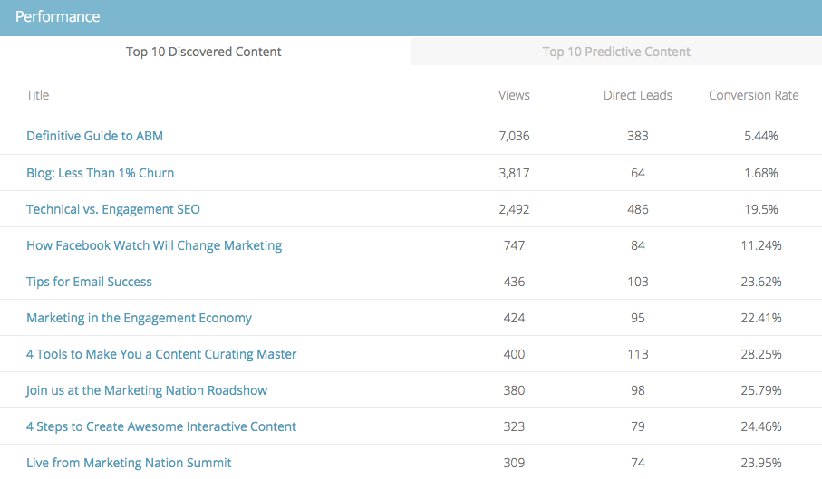

# El resumen del contenido predictivo {#the-predictive-content-summary}

>[!NOTE]
>
>Según la fecha de compra, la suscripción de marketing puede incluir Contenido predictivo de marketing o Contenido`AI`. Para aquellos que utilizan contenido predictivo, Marketing está activando las funciones de análisis de contenido`AI` hasta el 30 de abril de 2018. Para mantener estas funciones más allá de esa fecha, póngase en contacto con el administrador de éxito del cliente de Marketing to para actualizar a Contenido de marketing`AI`.

El resumen de contenido predictivo muestra la información que necesita sobre el contenido predictivo de un vistazo, con tablas, gráficos y números actuales.

## Barra superior {#top-bar}

La barra superior muestra los números actuales para el contenido y las vistas, así como la cantidad de fragmentos habilitados. Seleccione una vista de los últimos 7 o 30 días para toda la página en la esquina superior derecha.

## Tabla de rendimiento {#performance-table}

Aquí es donde puede ver los 10 primeros fragmentos de contenido descubierto, incluyendo vistas, posibles clientes directos y tasa de conversión.

## Participación predictiva {#predictive-engagement}

Vea su tasa de conversión comparando los clics totales y los posibles clientes directos, y compare el rendimiento de las diferentes fuentes.

## Tendencia del contenido por Vistas {#content-trend-by-views}

Compare cómo sus vistas de todo el contenido coinciden con el contenido predictivo.

## Categorías principales por compromiso {#top-categories-by-engagement}

¿Qué categorías de contenido son más atractivas? Véalo en este gráfico.

>[!NOTE]
>
>Si hace clic en un vínculo de categoría (ejemplos en la imagen anterior: leader, correo electrónico, etc.) abre la página de contenido Todos con la categoría en la que hizo clic y que se agregó al filtro, mostrando los análisis de contenido en esa categoría.

>[!MORELIKETHIS]
>
>* [Uso de todo el contenido](https://docs.marketo.com/display/docs/working+with+all+content)
>* [Uso de contenido predictivo](https://docs.marketo.com/display/docs/working+with+predictive+content)

>

