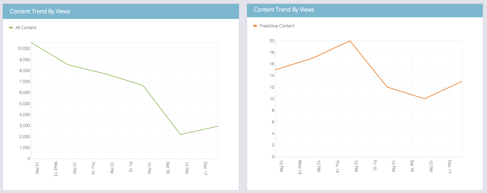

# El resumen de contenido predictivo {#the-predictive-content-summary}

El resumen de contenido predictivo muestra la información que necesita acerca de su contenido predictivo de un vistazo, con tablas, gráficos y números actuales.

## Barra superior {#top-bar}

La barra superior muestra los números actuales de contenido y vistas, y cuántas partes están habilitadas. Seleccione una vista de los últimos 7 o 30 días para toda la página en la esquina superior derecha.

## Tabla de rendimiento {#performance-table}

Aquí es donde puede ver los 10 fragmentos principales de contenido descubierto, incluidas vistas, posibles clientes directos y tasa de conversión.

## Participación predictiva {#predictive-engagement}

Consulte la tasa de conversión comparando el total de clics y los posibles clientes, y compare el rendimiento de las diferentes fuentes.

## Tendencia del contenido por vistas  {#content-trend-by-views}

Compare cómo coinciden las vistas de todo el contenido con el contenido predictivo.

## Categorías principales por participación {#top-categories-by-engagement}

¿Qué categorías de contenido son más atractivas? Véalo en este gráfico.

>[!NOTE]
>
>Si hace clic en un vínculo de categoría (ejemplos en la imagen anterior: leadGen, correo electrónico, etc.), se abre la página Todo el contenido con la categoría en la que ha hecho clic añadida al filtro y se muestra el análisis de contenido en esa categoría.
