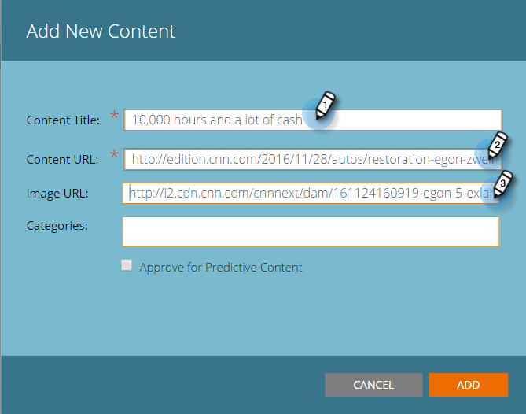

# Añadir contenido nuevo {#add-new-content}

Puede añadir contenido fácilmente de forma manual a la página Todo el contenido .

1. Haga clic en el **Añadir contenido** y seleccione **Añadir contenido**.

   

1. Introduzca un título y una URL, así como una URL de imagen si la necesita.

   

1. Para añadir categorías, haga clic en el campo y seleccione en la lista desplegable .

   

1. Haga clic en **Agregar**.

   

1. El nuevo título ahora aparece en la sección **Todo el contenido** página. Tenga en cuenta que aún no está aprobado para contenido predictivo.

   

1. Así es como agregarlo a [Contenido predictivo](/help/marketo/product-docs/predictive-content/working-with-all-content/approve-a-title-for-predictive-content.md).
