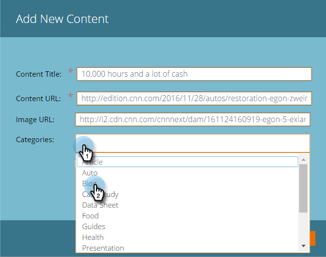

# Añadir nuevo contenido {#add-new-content}

Puede agregar fácilmente contenido manualmente a la página [!UICONTROL Todo el contenido].

1. Haga clic en el menú desplegable **[!UICONTROL Agregar contenido]** y seleccione **[!UICONTROL Agregar contenido]**.

   

1. Introduzca un título, una dirección URL y una dirección URL de imagen, si la necesita.

   

1. Para añadir categorías, haga clic en el campo y seleccione en la lista desplegable.

   

1. Haga clic en **[!UICONTROL Agregar]**.

   

1. El nuevo título ahora aparece en la página **[!UICONTROL Todo el contenido]**. Tenga en cuenta que aún no está aprobado para contenido predictivo.

   

1. Así es como se agrega a [Contenido predictivo](/help/marketo/product-docs/predictive-content/working-with-all-content/approve-a-title-for-predictive-content.md).
