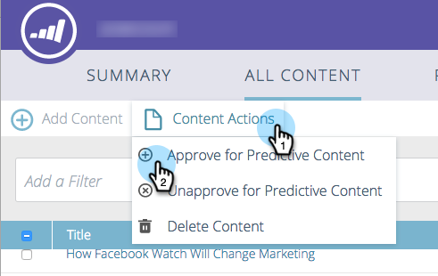

# Aprobar un título para contenido predictivo {#approve-a-title-for-predictive-content}

Puede añadir cualquier título en la página Todo el contenido al contenido predictivo aprobándolo en la página Todo el contenido o en la ventana emergente Editar contenido.

## Página de todo el contenido {#all-content-page}

1. Marque la casilla junto al fragmento de contenido.

   

1. Haga clic en **Acciones de contenido** y seleccione. **Aprobar para contenido predictivo**.

   

## Editar ventana emergente de contenido {#edit-content-pop-up}

También puede aprobar títulos para contenido predictivo directamente en la ventana emergente Editar contenido.

1. Pase el ratón sobre un fragmento de contenido y haga clic en el icono de edición al final de la fila.

   

1. Compruebe la **Aprobar para contenido predictivo** en la ventana emergente Editar contenido y haga clic en **Guardar**.

   

Sea cual sea la forma en que utilice, el icono Aprobar para contenido predictivo ahora aparece en la fila.

Ahora puede ver el título en la página Contenido predictivo.

