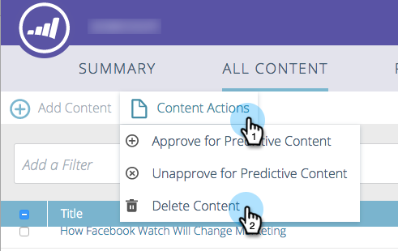

# Eliminar contenido {#delete-content}

>[!NOTE]
>
>Según la fecha de compra, la suscripción de marketing puede incluir Contenido`AI`predictivo de marketing o Contenido. Para aquellos que utilizan contenido predictivo, Marketing`AI` está activando las funciones de Content Analytics hasta el 30 de abril de 2018. Para mantener estas funciones más allá de esa fecha, póngase en contacto con el administrador de éxito del cliente de Marketing to para actualizar a Contenido`AI`de marketing.

Cuando ya no se necesita un fragmento de contenido, es fácil deshacerse de él.

1. Marque la casilla al lado del contenido que desee eliminar.

   

1. Haga clic en la lista desplegable Acciones **de** contenido y seleccione **Eliminar contenido**.

   

   Eso es todo.

