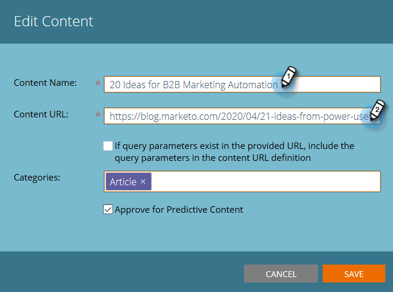

# Editar contenido {#edit-content}

Puede realizar algunas ediciones en los listados de la página Todo contenido .

1. En el **Todo el contenido** , pase el ratón sobre la fila del título que desea editar y haga clic en el icono editar .

   

1. Realice cambios en el título del contenido y en la URL de contenido (la casilla de verificación de parámetros de consulta es opcional).

   

1. Haga clic en el **Categorías** para agregar o quitar categorías. Seleccione las nuevas en la lista desplegable . Puede quitar una categoría seleccionada actualmente haciendo clic en su **X**.

   

1. Marque la **Aprobar para contenido predictivo** para aprobar, o desmarque la casilla para desaprobar. Haga clic en **Guardar** cuando haya terminado.

   
