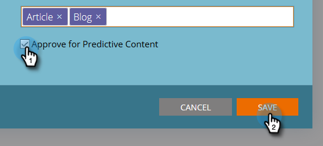

# Editar contenido {#edit-content}

Puedes hacer algunas ediciones en los anuncios de la página [!UICONTROL Todo el contenido].

1. En la página **[!UICONTROL Todo el contenido]**, pase el ratón sobre la fila del título que quiera editar y haga clic en el icono de edición.

   

1. Realice cambios en [!UICONTROL Nombre de contenido] y en [!UICONTROL URL de contenido] (la casilla de verificación de parámetros de consulta es opcional).

   

1. Haga clic en el campo **[!UICONTROL Categorías]** para agregar o quitar categorías. Seleccione nuevas en la lista desplegable. Puede quitar una categoría seleccionada actualmente haciendo clic en su **X**.

   

1. Marque la casilla **[!UICONTROL Aprobar contenido predictivo]** para aprobarla o desmarque la casilla para desaprobarla. Haga clic en **[!UICONTROL Guardar]** cuando termine.

   
