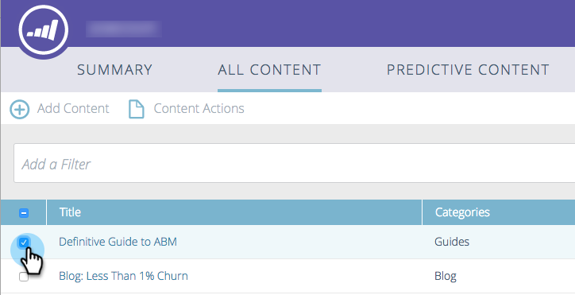

# Desaprobar un título para contenido predictivo {#unapprove-a-title-for-predictive-content}

Puede desaprobar cualquier título de contenido predictivo en la página Todo contenido o en la ventana emergente Editar contenido .

## Página Todo el contenido {#all-content-page}

1. En la página Todo contenido , marque la casilla junto al fragmento de contenido para seleccionarlo.

   

1. Haga clic en el **Acciones de contenido** y seleccione **Desaprobar contenido predictivo**.

   

## Editar contenido emergente {#edit-content-pop-up}

Puede desaprobar un título mientras lo está editando.

1. Pase el ratón sobre un fragmento de contenido y, a continuación, haga clic en el icono de edición situado al final de la fila.

   

1. Desmarque la **Aprobar para contenido predictivo** y haga clic en **Guardar**.

   

Independientemente del método que utilice, el icono de aprobación pasa a la página Todo contenido y el título desaparece de la página Contenido predictivo .

