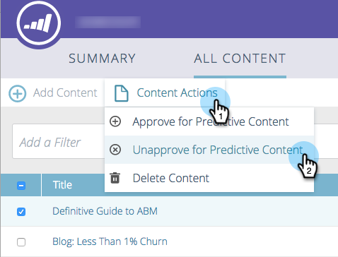

# Desaprobar un título para [!UICONTROL contenido predictivo] {#unapprove-a-title-for-predictive-content}

Puede desaprobar cualquier título para contenido predictivo en su página [!UICONTROL Todo el contenido] o en la ventana emergente [!UICONTROL Editar contenido].

## [!UICONTROL Todo el contenido] Página {#all-content-page}

1. En la página [!UICONTROL Todo el contenido], marque la casilla junto al fragmento de contenido para seleccionarlo.

   

1. Haga clic en el menú desplegable **[!UICONTROL Acciones de contenido]** y seleccione **[!UICONTROL Desaprobar contenido predictivo]**.

   

## Ventana emergente [!UICONTROL Editar contenido] {#edit-content-pop-up}

Puede desaprobar un título mientras lo está editando.

1. Pase el ratón sobre un fragmento de contenido y, a continuación, haga clic en el icono de edición al final de la fila.

   

1. Desmarque la casilla **[!UICONTROL Aprobar contenido predictivo]** y haga clic en **[!UICONTROL Guardar]**.

   

Independientemente del método que utilice, el icono de aprobación desaparece en la página [!UICONTROL Todo el contenido] y el título desaparece de la página [!UICONTROL Contenido predictivo].

