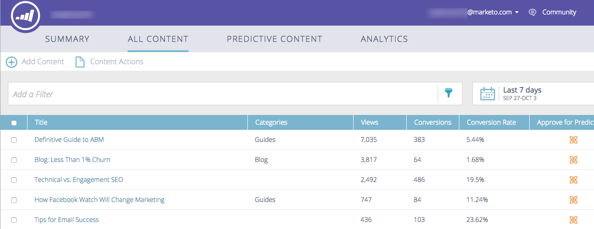
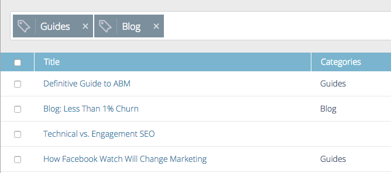
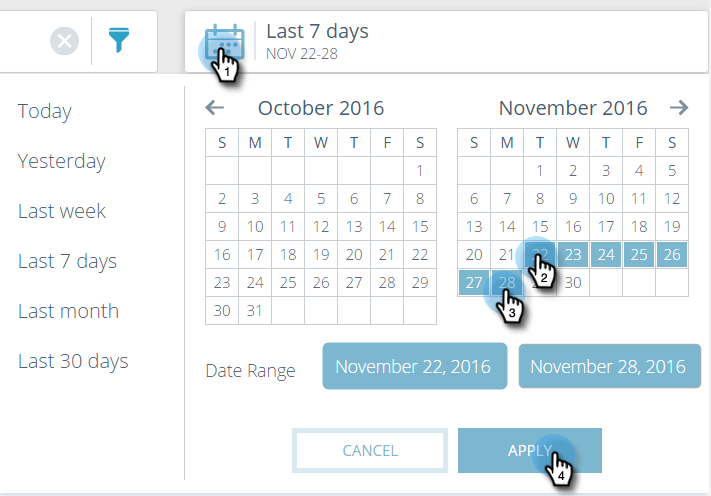

# Explicación de todo el contenido {#understanding-all-content}

La página Todo el contenido muestra todo el contenido que se ha descubierto o agregado manualmente.

Los campos de página incluyen:

* **Título**: El nombre del contenido
* **Categorías**: Creado por usted y utilizado para agrupar los resultados predictivos para Web o correo electrónico
* **Vistas**: Total de clics en contenido web detectado (incluidas todas las fuentes)
* **Conversiones**: El número de visitantes que vieron un fragmento de contenido y completaron un formulario en la misma visita
* **tasa de conversión**: Un porcentaje calculado por conversiones directas divididas por clics
* **Aprobar predictivo**: Se muestra un icono si se aprueba el contenido

Puede agregar un nuevo contenido y rastrearlo, eliminar un fragmento de contenido o aprobar un fragmento de contenido. Después de aprobar el contenido, puede editarlo en la página Contenido predictivo.

## Filtrar contenido por Categorías {#filter-content-by-categories}

Para filtrar el contenido, seleccione una o varias categorías. A continuación, configure la fecha o el intervalo de fechas para el análisis de contenido mediante la configuración estándar o personalizada.

1. En la página **Todo el contenido**, haga clic en el icono de filtro y, en **Categoría**, seleccione una o varias categorías de contenido.

   

1. Ahora, solo se muestra el contenido de esa categoría.

   

## Mostrar Analytics para una fecha o un intervalo de fechas {#display-analytics-for-a-date-or-date-range}

1. Para mostrar los datos de una fecha o intervalo de fechas específicos, haga clic en el icono de calendario y, a continuación, seleccione en el panel izquierdo. Para un intervalo de fechas personalizado, haga clic en el primer y último día del intervalo de fechas en el calendario (como se muestra). Haga clic en **Aplicar**.

   

1. Ahora, se muestra el análisis del contenido en el intervalo de fechas seleccionado.

>[!MORELIKETHIS]
>
>* [Añadir nuevo contenido](/help/marketo/product-docs/predictive-content/working-with-all-content/add-new-content.md)
>* [Eliminar contenido](/help/marketo/product-docs/predictive-content/working-with-all-content/delete-content.md)
>* [Aprobar un título para contenido predictivo](/help/marketo/product-docs/predictive-content/working-with-all-content/approve-a-title-for-predictive-content.md)
>* [Desaprobar un título para contenido predictivo](/help/marketo/product-docs/predictive-content/working-with-all-content/unapprove-a-title-for-predictive-content.md)

