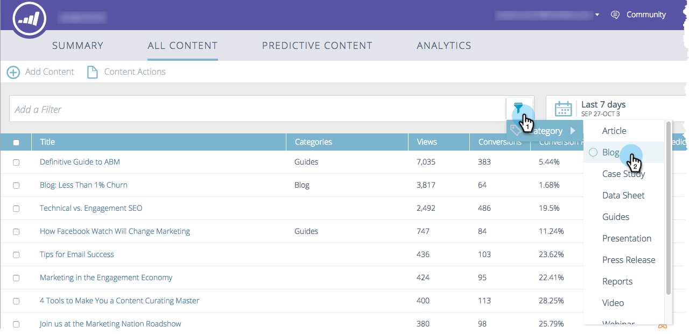
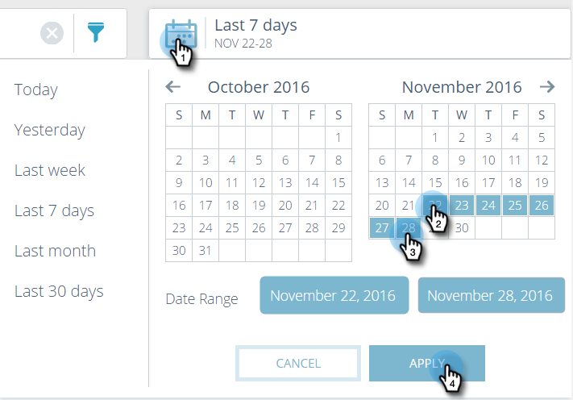

# Comprensión de todo el contenido {#understanding-all-content}

La página Todo el contenido muestra todo el contenido que se ha detectado o añadido manualmente.

Los campos de página incluyen:

* **[!UICONTROL Título]**: El nombre del fragmento de contenido
* **[!UICONTROL Categorías]**: creadas por usted y utilizadas para agrupar sus resultados predictivos para la web o el correo electrónico
* **[!UICONTROL Vistas]**: Clics totales en contenido web detectado (incluidos todos los orígenes)
* **[!UICONTROL Conversiones]**: El número de visitantes que vieron un fragmento de contenido y completaron un formulario en la misma visita
* **[!UICONTROL Tasa de conversión]**: Un porcentaje calculado por conversiones directas dividido por clics
* **[!UICONTROL Aprobar para Predictive]**: El icono se muestra si el contenido está aprobado

Puede añadir un nuevo fragmento de contenido y rastrearlo, eliminarlo o aprobar un fragmento de contenido. Después de aprobar el contenido, puede editarlo en la página Contenido predictivo.

## Filtrar contenido por categorías  {#filter-content-by-categories}

Filtre el contenido seleccionando una o más categorías. A continuación, configure la fecha o el intervalo de fechas para el análisis de contenido mediante la configuración estándar o personalizada.

1. En la página **[!UICONTROL Todo el contenido]**, haga clic en el icono de filtro y, en **[!UICONTROL Categoría]**, seleccione una o varias categorías de contenido.

   

1. Ahora solo se muestra el contenido de esa categoría.

   

## Mostrar Analytics para una fecha o un intervalo de fechas {#display-analytics-for-a-date-or-date-range}

1. Para mostrar los datos de una fecha o un intervalo de fechas específico, haga clic en el icono de calendario y, a continuación, seleccione en el panel izquierdo. Para un intervalo de fechas personalizado, haga clic en el primer y último día del intervalo de fechas en el calendario (como se muestra). Haga clic en **[!UICONTROL Aplicar]**.

   

1. Ahora, Analytics muestra el contenido en el intervalo de fechas seleccionado.

>[!MORELIKETHIS]
>
>* [Agregar contenido nuevo](/help/marketo/product-docs/predictive-content/working-with-all-content/add-new-content.md)
>* [Eliminar contenido](/help/marketo/product-docs/predictive-content/working-with-all-content/delete-content.md)
>* [Aprobar un título para contenido predictivo](/help/marketo/product-docs/predictive-content/working-with-all-content/approve-a-title-for-predictive-content.md)
>* [Desaprobar un título para contenido predictivo](/help/marketo/product-docs/predictive-content/working-with-all-content/unapprove-a-title-for-predictive-content.md)
