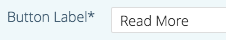

# Editar contenido predictivo para correos electrónicos {#edit-predictive-content-for-emails}

A continuación se muestra cómo configurar el contenido predictivo para los correos electrónicos.

>[!PREREQUISITES]
>
>El contenido debe [aprobarse para contenido predictivo](/help/marketo/product-docs/predictive-content/working-with-all-content/approve-a-title-for-predictive-content.md) en la página Todo el contenido.

1. En la página Contenido predictivo, haga clic en un título para abrir el editor.

   

1. Se abre la página de edición. **De forma predeterminada,** se muestran correos electrónicos.

   

   >[!NOTE]
   >
   >El título y la dirección URL ya están rellenados. Verifique que sean lo que usted quiere.

1. Para agregar o editar la etiqueta del botón, escriba en el cuadro de texto a su derecha.

   

   >[!NOTE]
   >
   >Si ha cambiado la etiqueta del botón, se actualizará cuando guarde los cambios o previsualización de la imagen.

1. Para agregar o editar la dirección URL de la imagen, haga clic en **Editar imagen**.

   

1. Inserte la dirección URL de la imagen y haga clic en **Añadir**.

   

1. Haga clic y arrastre el control deslizante para cambiar el tamaño de la imagen. A continuación, haga clic y arrastre el cuadro de recorte para aislar el área de imagen deseada. Haga clic en **Previsualización** cuando termine.

   

1. Haga clic en las flechas de los lados para desplazarse y vista del contenido en cada una de las previsualizaciones de diseño de correo electrónico (se muestran dos opciones).

   |  |  |
   |---|---|

1. Si lo desea, haga clic en el campo **Categorías** y agregue categorías al contenido. Las opciones proceden de las [categorías que ya ha configurado](/help/marketo/product-docs/predictive-content/getting-started/set-up-categories.md).

   

1. Marque la casilla para habilitar Contenido predictivo en Correo electrónico.

   

1. Haga clic en **Guardar**.

   

   >[!NOTE]
   >
   >En el Editor de correo electrónico de marketing v2.0, también puede [vista de las plantillas de diseño](/help/marketo/product-docs/predictive-content/enabling-predictive-content/enable-predictive-content-in-emails.md) que utiliza mientras activa el contenido.
