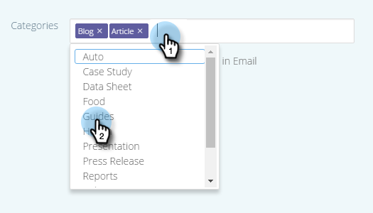

# Editar contenido predictivo para correos electrónicos {#edit-predictive-content-for-emails}

A continuación se muestra cómo configurar el contenido predictivo para los correos electrónicos.

>[!PREREQUISITES]
>
>El contenido debe [aprobado para contenido predictivo](/help/marketo/product-docs/predictive-content/working-with-all-content/approve-a-title-for-predictive-content.md) en la página Todo el contenido .

1. En la página Contenido predictivo , haga clic en un título para abrir el editor.

   

1. Se abre la página de edición. **Correo electrónico** se muestra de forma predeterminada.

   

   >[!NOTE]
   >
   >El título y la dirección URL ya están completados. Compruebe que son lo que desea.

1. Para añadir o editar la etiqueta del botón, escriba en el cuadro de texto a su derecha.

   

   >[!NOTE]
   >
   >Si ha cambiado la etiqueta del botón, se actualizará cuando guarde los cambios o previsualice la imagen.

1. Para añadir o editar la dirección URL de la imagen, haga clic en **Editar imagen**.

   

   >[!CAUTION]
   >
   >Para garantizar la mejor calidad, la imagen debe ser de 400 x 400 píxeles o más pequeña.

1. Inserte la dirección URL de la imagen y haga clic en **Agregar**.

   

1. Haga clic y arrastre el control deslizante para cambiar el tamaño de la imagen. A continuación, haga clic y arrastre el cuadro de recorte para aislar el área de imagen que desee utilizar. Haga clic en **Vista previa** cuando haya terminado.

   

1. Haga clic en las flechas de los lados para desplazarse por el contenido y verlo en cada una de las vistas previas del diseño del correo electrónico (se muestran dos opciones).

   |  |  |
   |---|---|

1. Si lo desea, haga clic en el **Categorías** y añada categorías al contenido. Las opciones son de la [categorías que ya ha configurado](/help/marketo/product-docs/predictive-content/getting-started/set-up-categories.md).

   

1. Marque la casilla para habilitar Contenido predictivo en Correo electrónico.

   

1. Haga clic en **Guardar**.

   

   >[!NOTE]
   >
   >En Marketo Email Editor v2.0 también puede [ver las plantillas de diseño](/help/marketo/product-docs/predictive-content/enabling-predictive-content/enable-predictive-content-in-emails.md) utiliza mientras activa el contenido.
