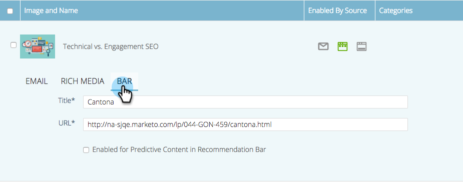

# Editar contenido predictivo para la barra de recomendaciones {#edit-predictive-content-for-the-recommendation-bar}

A continuación se muestra cómo configurar el contenido predictivo para la barra de recomendaciones.

>[!PREREQUISITES]
>
>El contenido debe [aprobado para contenido predictivo](/help/marketo/product-docs/predictive-content/working-with-all-content/approve-a-title-for-predictive-content.md) en la página Todo el contenido .

1. En el **Contenido predictivo** , haga clic en un título para abrir el editor.

   

1. Haga clic en **Barra**.

   

1. Marque la casilla para habilitar Contenido predictivo en la barra de recomendaciones.

   

1. Haga clic en **Guardar**.

   
