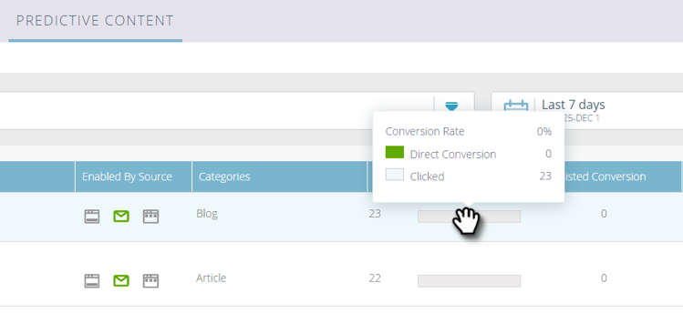

# Explicación del contenido predictivo {#understanding-predictive-content}

Después de que [apruebe un título para contenido predictivo](/help/marketo/product-docs/predictive-content/working-with-all-content/approve-a-title-for-predictive-content.md), trabajará en él aquí. La página Contenido predictivo muestra todos los títulos aprobados para el contenido predictivo.

Los campos de página incluyen:

* **Imagen y título**: El nombre del fragmento de contenido y la imagen seleccionada
* **Habilitado por la fuente**: Muestra si el título está aprobado para medios enriquecidos, correo electrónico o la barra de recomendaciones.
* **Categorías**: Creado por usted y utilizado para agrupar los resultados predictivos para Web o correo electrónico
* **Clics**: Total de clics en contenido recomendado (incluidas todas las fuentes)
* **tasa de conversión**: Un porcentaje calculado mediante conversiones directas divididas por clics. Pase el ratón por encima para ver datos adicionales (ver abajo)
* **Conversión** asistida: Visitantes que hicieron clic en el contenido recomendado en una visita anterior y completaron un formulario más tarde

## Filtrado de contenido {#filtering-content}

**Categoría**

Puede filtrar el contenido por categorías que haya creado. Haga clic en el icono de filtro y, en **Categoría**, seleccione una o varias categorías de contenido.

**Origen habilitado**

Filtre por cada tipo de contenido habilitado: Correo electrónico, Medios enriquecidos, Barra de recomendaciones.

**Analytics por fuente**

El filtrado de análisis de contenido habilitado le permite ver el rendimiento de cada fuente.

## Mostrar análisis por fecha {#display-analytics-by-date}

1. seleccione las fechas de inicio y finalización a la derecha (como se muestra). Haga clic en **Aplicar**.

   

## Datos de tabla de vista para contenido predictivo {#view-table-data-for-predictive-content}

En la tabla, puede realizar la vista de los orígenes habilitados para el contenido predictivo, de izquierda a derecha: Barra de recomendaciones, correo electrónico y medios enriquecidos. Las fuentes habilitadas se muestran en verde. Estos se activan al editar el contenido.

Pase el ratón sobre la barra de la columna Tasa de conversión para ver la tasa de conversión de vistas, la conversión directa y los datos en los que se ha hecho clic.

>[!NOTE]
>
>**Definiciones**
>
>**tasa de conversión**: Un porcentaje calculado por conversiones directas divididas por clics
>
>**Conversión** directa: Visitantes que hicieron clic en el contenido recomendado y completaron un formulario en la misma visita
>
>**Clic**: Total de clics en contenido recomendado (incluidas las tres fuentes)
