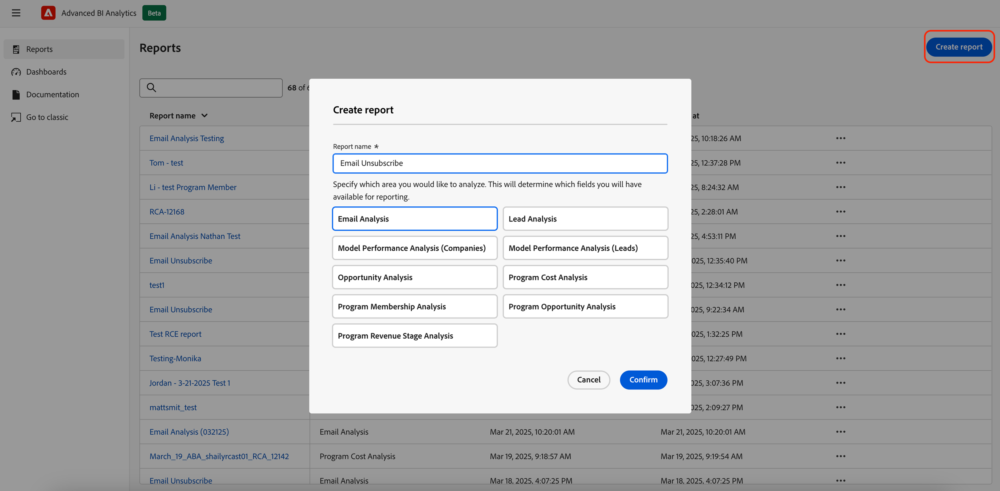
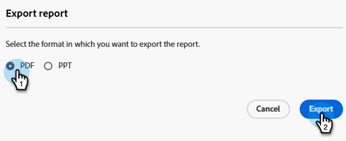

# Información general avanzada de BI Analytics {#advanced-bi-analytics-overview}

Advanced BI Analytics (anteriormente conocido como Revenue Explorer y Advanced Report Builder) ofrece una interfaz de informes y visualización flexible sobre los datos de Marketo Engage, que proporciona detalles granulares sobre la progresión, el rendimiento y mucho más. Ofrece una mejor interactividad y visualización, un rendimiento más rápido y una experiencia de usuario más fluida e intuitiva.

Estas mejoras le permiten ahorrar tiempo, descubrir perspectivas más valiosas, impulsar la optimización y compartir historias de datos más atractivas con compañeros de trabajo e interesados.

>[!PREREQUISITES]
>
>Para acceder a esta función, debe haber adquirido el complemento de Analytics de BI avanzado. Póngase en contacto con el equipo de cuenta de Adobe (su administrador de cuentas) para obtener más información.

## Características y ventajas principales {#key-features-and-benefits}

* **Motor de consulta de alto rendimiento**: Ofrece un rendimiento 5 veces más rápido en conjuntos de datos grandes, lo que permite un procesamiento de datos más rápido, una carga de informes más rápida y una experiencia de análisis más fluida.

* **Visualización enriquecida y atractiva**: Amplia colección de opciones de visualización integradas, incluidos gráficos, mapas e indicadores KPI, que hacen que los paneles sean más reveladores e impactantes y mejoran significativamente la narración de datos.

* **Interactividad avanzada y filtrado dinámico**: aplique divisores dinámicos, filtros cruzados y filtros interdependientes en los elementos visuales. Los informes de varias páginas admiten desgloses, desgloses detallados y obtención de detalles avanzados, lo que garantiza una exploración de datos sin esfuerzo.

* **Interfaz intuitiva de creación de informes**: la experiencia de apuntar y hacer clic simplifica la creación de informes, incluidos los informes de obtención de detalles de varias páginas. La interfaz permite a los usuarios diseñar informes complejos e interactivos sin requerir una profunda experiencia técnica.

* **Uso compartido fácil, incluida la exportación de PowerPoint**: La funcionalidad de uso compartido integrada facilita el uso compartido de perspectivas. Entre otros destinos, los usuarios pueden generar fácilmente diapositivas de PowerPoint preparadas para la presentación.

## Creación de un informe {#create-a-report}

1. En Mi Marketo, haga clic en el mosaico **[!UICONTROL Análisis de BI avanzados]**.

   {width="800" zoomable="yes"}

1. En la ficha **[!UICONTROL Informes]**, haga clic en **[!UICONTROL Crear informe]**.

   {width="800" zoomable="yes"}

1. Seleccione las medidas que desee.

   {width="800" zoomable="yes"}

1. Seleccione las dimensiones que desee.

   {width="800" zoomable="yes"}

1. Elija su visualización preferida.

   {width="800" zoomable="yes"}

1. Añada filtros arrastrando y soltando un atributo de dimensión.

   {width="800" zoomable="yes"}

## Exportación de informes {#export-a-report}

Al exportar un informe completo, las opciones de exportación son PDF y PPT. Si necesita los datos en .XLS o .CSV, puede hacerlo exportando visualizaciones individuales ([vea abajo](#export-a-visualization)).

>[!BEGINTABS]

>[!TAB De la página Informes]

1. En la página Informes, haga clic en el icono &#39;más&#39; (...) del informe deseado y seleccione **Exportar**.

   

1. Elija PDF o PPT y haga clic en **Exportar**.

   

>[!TAB Dentro del informe]

1. Dentro del informe, haga clic en el icono &#39;más&#39; (**...**) en la esquina superior derecha y seleccione **Exportar**.

   

1. Elija PDF o PPT y haga clic en **Exportar**.

   

>[!ENDTABS]

### Exportar una visualización {#export-a-visualization}

Obtenga información sobre cómo exportar secciones específicas del informe.

1. Elija el informe que desee.

   {width="600" zoomable="yes"}

1. Pase el ratón sobre la visualización mostrada para mostrar tres iconos.

   {width="600" zoomable="yes"}

1. Haga clic en el icono &#39;más&#39; (**`...`**)

   

1. Seleccione **Exportar datos**.

   

1. Elija el formato de datos que desee.

   

   >[!NOTE]
   >
   >* _Los datos con diseño actual_ solo están disponibles para los elementos visuales de tabla y matriz.
   >* _Los datos subyacentes_ no están disponibles en Marketo Engage.

1. Elija el formato de archivo deseado (.XLS, .CSV).

   

1. Haga clic en **Exportar**.

## Demostración en vídeo {#video}

Vea el siguiente vídeo para ver un ejemplo de una experiencia de informe de obtención de detalles de varias páginas.

>[!VIDEO](https://video.tv.adobe.com/v/3451681/?quality=12&learn=on){transcript=true}

## Informes estándar en Advanced BI Analytics {#standard-reports}

Los siguientes informes estándar se incluyen como ejemplos para los informes personalizados.

<table>
  <thead>
    <tr>
      <th>Área de informes</th>
      <th>Nombre del informe</th>
    </tr>
  </thead>
  <tbody>
    <tr>
      <td rowspan="8">Análisis de correo electrónico</td>
      <td>Correo electrónico: actividad enviada (en CST)</td>
    </tr>
    <tr>
      <td>Correo electrónico: actividad de clic (en CST)</td>
    </tr>
    <tr>
      <td>Correo electrónico: actividad abierta (en CST)</td>
    </tr>
    <tr>
      <td>Correo electrónico: distribución del tiempo en el que se hizo clic (en CST)</td>
    </tr>
    <tr>
      <td>Correo electrónico: caída de velocidad de apertura</td>
    </tr>
    <tr>
      <td>Correo electrónico: distribución del tiempo de apertura (en CST)</td>
    </tr>
    <tr>
      <td>Correo electrónico: detalles de rendimiento</td>
    </tr>
    <tr>
      <td>Correo electrónico: caída de tasa de clics</td>
    </tr>
    <tr>
      <td rowspan="8">Análisis de leads</td>
      <td>Principales 10 fuentes de posibles clientes por posibles clientes convertidos</td>
    </tr>
    <tr>
      <td>Principales 10 fuentes de posibles clientes</td>
    </tr>
    <tr>
      <td>Informe de infracciones de SLA</td>
    </tr>
    <tr>
      <td>Informe de vencimiento del posible cliente</td>
    </tr>
    <tr>
      <td>Informe Balance de Clientes Potenciales</td>
    </tr>
    <tr>
      <td>Informe de conversión de posibles clientes</td>
    </tr>
    <tr>
      <td>Informe de flujo de clientes potenciales</td>
    </tr>
    <tr>
      <td>Informe de tiempo de transición de posibles clientes</td>
    </tr>
    <tr>
      <td rowspan="5">Análisis del programa</td>
      <td>Principales 10 programas por éxito</td>
    </tr>
    <tr>
      <td>Los 10 programas principales por canalización total</td>
    </tr>
    <tr>
      <td>Informe de fase de ingresos del programa</td>
    </tr>
    <tr>
      <td>Principales 10 programas de adquisición</td>
    </tr>
    <tr>
      <td>Tendencia de inversión en canal de marketing</td>
    </tr>
    <tr>
      <td rowspan="7">Análisis de oportunidades</td>
      <td>Impacto del marketing en oportunidades cerradas</td>
    </tr>
    <tr>
      <td>Influencia del marketing en oportunidades ganadas cerradas</td>
    </tr>
    <tr>
      <td>Influencia del marketing en las oportunidades creadas</td>
    </tr>
    <tr>
      <td>(FT) Influencia del marketing en las oportunidades creadas</td>
    </tr>
    <tr>
      <td>(MT) Influencia de marketing en oportunidades cerradas ganadas</td>
    </tr>
    <tr>
      <td>(MT) Influencia de marketing en las oportunidades creadas</td>
    </tr>
    <tr>
      <td>(FT) Influencia de marketing en oportunidades cerradas ganadas</td>
    </tr>
    <tr>
      <td>Análisis de posible cliente de oportunidad</td>
      <td>Los 10 principales propietarios por oportunidades ganadas</td>
    </tr>
  </tbody>
</table>

## Cosas que debe tener en cuenta {#note}

* Sus informes personalizados se han duplicado de la experiencia clásica a la nueva con los cambios de comportamiento notables que se mencionan en la sección [Aprender la nueva experiencia](#learning-the-new-experience) que aparece a continuación.
* Los paneles de la experiencia clásica no se podían transferir y era necesario volver a crearlos en la nueva experiencia. Se pueden volver a crear como informes en la nueva experiencia y los filtros de la nueva experiencia extraen automáticamente los valores posibles.

  >[!NOTE]
  >
  >El tablero de la nueva experiencia es simplemente una recopilación de informes en una sola página. El valor principal del tablero en la nueva experiencia es permitirle presentar perspectivas analíticas en diferentes áreas de la creación de informes.

* Puede crear **hasta 700 informes** en Advanced BI Analytics.

  >[!NOTE]
  >
  >Si tenía más de 700 informes en el Explorador de ingresos, algunos se han combinado con otros y se han consolidado a través de páginas dentro del informe.
  >
  >* Si un informe tenía una suscripción por correo electrónico, no se combinaba.
  >* El resto de los informes de la _misma carpeta_ se combinaron en uno o más informes, por área de informe. Si había más de cinco informes para la esfera de presentación de informes, se consolidaron en más de un informe combinado.
  >* Cada informe combinado no tiene más de cinco páginas.

* Hay una limitación de 1 millón de filas por consulta en una visualización determinada. Si la consulta supera ese límite, recibirá el siguiente error: `The resultset of a query to external data source has exceeded the maximum allowed size of '1000000' rows`. Para solucionarlo, reduzca el intervalo de fechas o ajuste los filtros del informe para reducir el número de filas en el resultado de la consulta.

## Aprender la nueva experiencia {#learning-the-new-experience}

La nueva experiencia de visualización se ofrece mediante el servicio de Power BI integrado.

Para ver un tutorial rápido sobre la experiencia de visualización, visite la documentación de [Uso de elementos visuales en Power BI](https://learn.microsoft.com/en-us/training/modules/visuals-in-power-bi/){target="_blank"} de Microsoft. Tenga en cuenta que es posible que no vea todas estas funciones en Marketo Engage.

### Cambios importantes en la experiencia {#notable-experience-changes}

Los siguientes son cambios en la nueva experiencia (Advanced BI Analytics) de la experiencia clásica (Revenue Explorer/Advanced Report Builder).

* El filtro de tipo de fecha funciona de forma equivalente; sin embargo, la sintaxis para especificar valores ha cambiado. En los informes personalizados existentes, todos los valores de filtro de tipo de fecha (excepto &quot;Día de la semana&quot;) se convierten automáticamente a sus equivalentes en la nueva experiencia. Se ha interrumpido la compatibilidad con los valores de &quot;Día de la semana&quot;.

* Los filtros de tipo cadena ahora distinguen entre mayúsculas y minúsculas.

* La suscripción de correo electrónico incluye la exportación de PDF en lugar de la HTML del informe. La nueva suscripción de correo electrónico no incluye la definición del informe.

* En este momento no se admite el vínculo profundo del informe.

>[!NOTE]
>
>No se puede incluir más de un campo de grupo de campos personalizados en un campo visual para el área de informes de Análisis de rendimiento del modelo (posibles clientes).

>[!MORELIKETHIS]
>
>[Métricas y dimensiones](/help/marketo/product-docs/reporting/advanced-bi-analytics/metrics-and-dimensions.md){target="_blank"}
