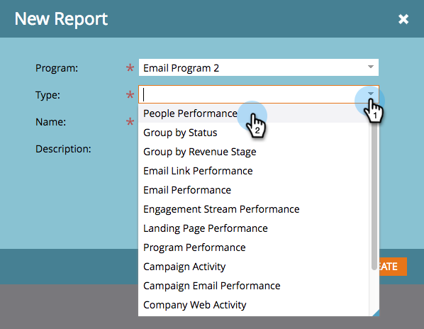

# Crear un informe en un Programa {#create-a-report-in-a-program}

Ejecute un informe para analizar personas, programas, páginas de aterrizaje, correos electrónicos y recursos sociales.

1. Vaya a **Actividades de marketing**.

   

1. Seleccione un programa.

   

   >[!NOTE]
   >
   >También puede crear informes desde la ficha **Analytics**.

1. Haga clic con el botón derecho en el programa y seleccione **Nuevo recurso local**.

   

1. Haga clic en **Informe**.

   

1. Seleccione el informe **Tipo**.

   

   >[!TIP]
   >
   >Consulte [Información general del tipo de informe](https://docs.marketo.com/display/DOCS/Report+Type+Overview) para obtener una breve descripción de cada uno.

1. Asigne un nombre al informe.

   

   >[!TIP]
   >
   >Para facilitar la navegación por los informes más adelante, incluya una referencia al tipo de informe en el nombre.

1. Configure el intervalo de tiempo del informe. Consulte [Cambio de un intervalo de tiempo del informe](/help/marketo/product-docs/reporting/basic-reporting/editing-reports/change-a-report-time-frame.md) para obtener más detalles.

1. Haga clic en la ficha **Informe** para ver las estadísticas.

   

   >[!NOTE]
   >
   >De forma predeterminada, los informes cubren toda la actividad de su cuenta, en todos los programas.

   >[!NOTE]
   >
   >Puede terminar rápidamente con muchos informes. Recuerde [eliminar un informe](/help/marketo/product-docs/reporting/basic-reporting/report-activity/delete-a-report.md) que ya no necesite.

   >[!MORELIKETHIS]
   >
   >Puede [cambiar un intervalo de tiempo del informe](/help/marketo/product-docs/reporting/basic-reporting/editing-reports/change-a-report-time-frame.md), [suscribirse a un informe básico](/help/marketo/product-docs/reporting/basic-reporting/report-subscriptions/subscribe-to-a-basic-report.md), [exportar un informe a Excel](/help/marketo/product-docs/reporting/basic-reporting/report-activity/export-a-report-to-excel.md), [filtrar personas en un informe con una lista inteligente](/help/marketo/product-docs/reporting/basic-reporting/editing-reports/filter-people-in-a-report-with-a-smart-list.md) y más.
