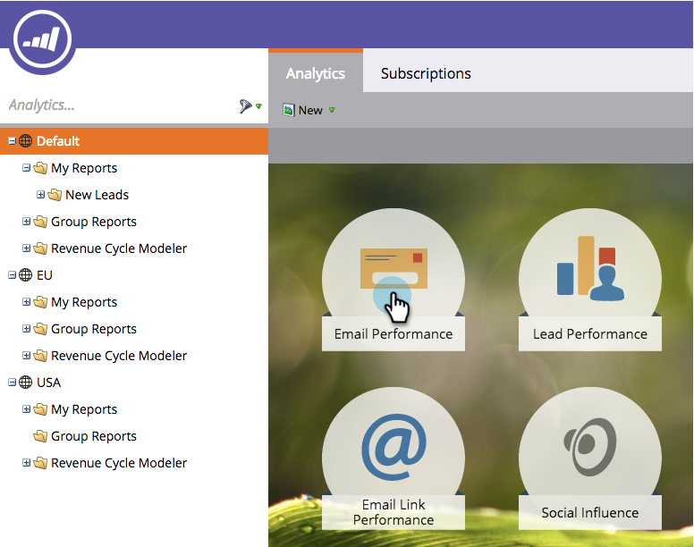

# Navegación por la página principal de análisis {#navigating-the-analytics-home-page}

1. Vaya al área de **[!UICONTROL Analytics]**.

   

1. Seleccione un [tipo de informe](/help/marketo/product-docs/reporting/basic-reporting/report-types/report-type-overview.md).

   

1. Una vez que haya ejecutado el informe, haga clic en el área de trabajo para regresar a la **página de inicio de Analytics**.

   

   ¡Excelente! Ya sabe cómo navegar por la página de inicio de Analytics.

>[!MORELIKETHIS]
>
>[Comprender mis informes y los informes de grupo](/help/marketo/product-docs/reporting/basic-reporting/creating-reports/understanding-my-reports-and-group-reports.md)
