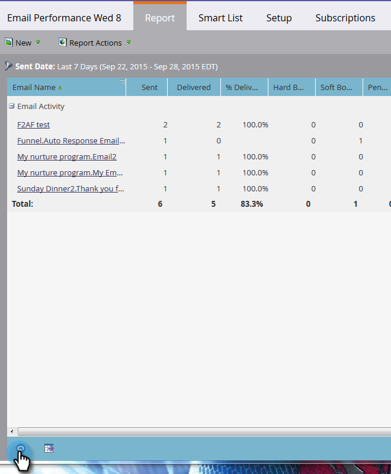

# Actualizar un informe {#refresh-a-report}

Después de ver un informe, Marketing lo almacena en la base de datos para que se cargue rápidamente en la próxima visualización. Después de la primera vista, los informes se actualizan automáticamente cada 24 horas para que siempre estén actualizados. Pero puede actualizarlas manualmente en cualquier momento que desee.

1. Para ver cuándo se actualizó el informe por última vez, pase el ratón sobre el icono de flecha de círculo en la esquina inferior izquierda.

   

1. Ese icono de flecha circular es el botón de actualización. Simplemente haga clic en él para obtener los últimos resultados.

   

1. También puede actualizar el informe haciendo clic en el menú **Acciones del informe** y seleccionando **Actualizar informe**.

   

   ¡Voilà!
