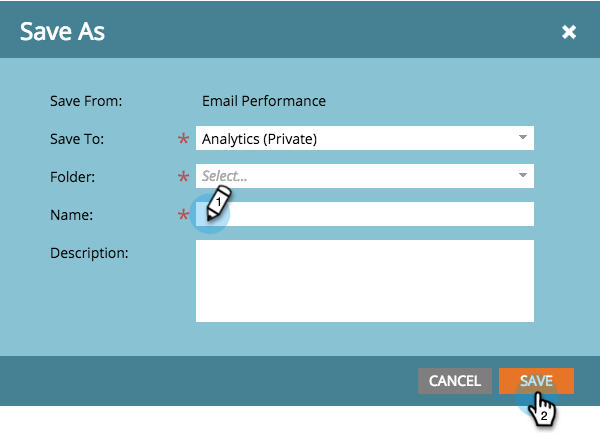

# Guardar un informe {#save-a-report}

En ocasiones, es posible que deba guardar un informe predeterminado para verlo de nuevo más adelante. Así puede hacerlo:

1. Vaya a la **Analytics** .

   

1. Seleccione un [tipo de informe](/help/marketo/product-docs/reporting/basic-reporting/report-types/report-type-overview.md).

   

1. Haga clic en **Acciones de informe** y seleccione **Guardar como**.

   

1. **Guardar en** una ubicación y seleccione una **Carpeta**.

   

1. **Nombre** el informe y haga clic en **Guardar**.

   

   ¡Genial! El informe guardado ahora aparecerá en el árbol.

   

>[!MORELIKETHIS]
>
>Obtenga información sobre cómo [clonar un informe para agrupar informes](/help/marketo/product-docs/reporting/basic-reporting/report-activity/clone-a-report-to-group-reports.md).
