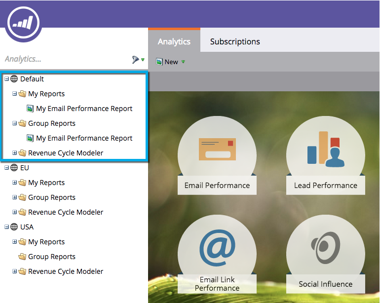

# Explicación de mis informes y los informes de grupo {#understanding-my-reports-and-group-reports}

Puede crear **Mis informes** y **Informes de grupo** desde la [Página principal de Analytics](/help/marketo/product-docs/reporting/basic-reporting/creating-reports/navigating-the-analytics-home-page.md).

**Mis** informes solo son visibles para usted.

**Todos los usuarios de esa área de trabajo pueden ver** los informes de grupo.

>[!NOTE]
>
>Cada área de trabajo tiene un conjunto de **Informes** y **Informes de grupo**.

>[!MORELIKETHIS]
>
>* [Guardar un informe](/help/marketo/product-docs/reporting/basic-reporting/creating-reports/save-a-report.md)
>* [Clonar un informe para agrupar informes](/help/marketo/product-docs/reporting/basic-reporting/report-activity/clone-a-report-to-group-reports.md)

