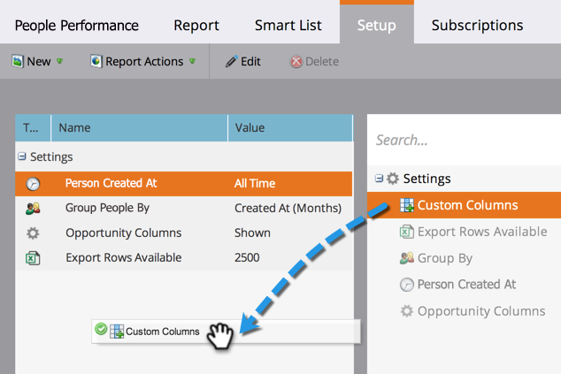

# Añadir columnas personalizadas en un informe de persona {#add-custom-columns-to-a-person-report}

Puede filtrar aún más las métricas de los informes [de](http://docs.marketo.com/display/docs/basic+reporting) personas utilizando sus listas  inteligentes como columnas personalizadas.

1. Vaya al área Actividades **** de marketing (o **Analytics**).

   

1. Seleccione el informe y haga clic en la ficha **Configuración** .

   

1. Arrastre sobre las columnas **** personalizadas.

   

1. Seleccione las listas inteligentes que se utilizarán como columnas de informes.

   

   >[!NOTE]
   >
   >**Buceo profundo**
   >
   >
   >Aprenda a crear y configurar listas inteligentes en el buceo profundo de Listas [inteligentes y Listas](http://docs.marketo.com/display/docs/smart+lists+and+static+lists) estáticas.

1. ¡Lo has hecho! Haga clic en la ficha **Informe** para ver el informe con las nuevas columnas.

   

   >[!NOTE]
   >
   >**Artículos relacionados**
   >
   >
   >También puede [Añadir columnas de oportunidades en un informe](add-opportunity-columns-to-a-lead-report.md)de posibles clientes.

   >[!NOTE]
   >
   >**Buceo profundo**
   >
   >
   >Obtenga más información sobre las muchas cosas que puede hacer con los informes en la inmersión profunda del Sistema de informes  básico.

