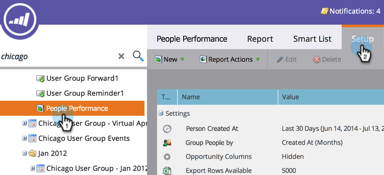
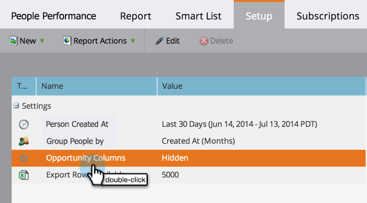
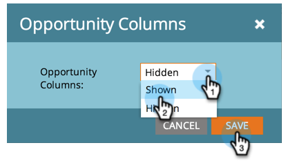
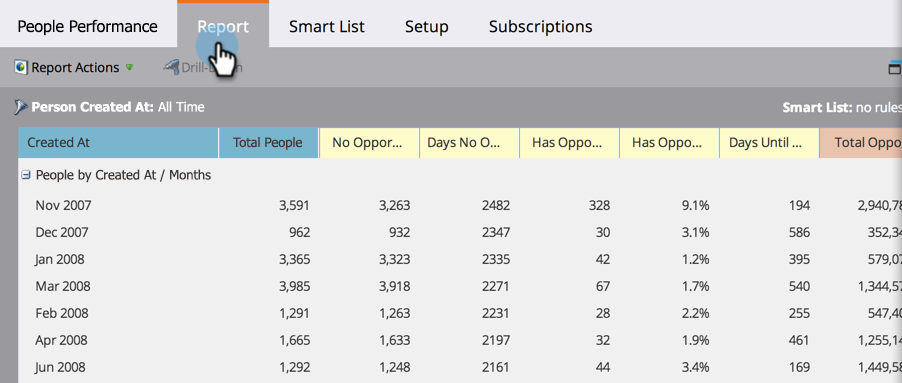
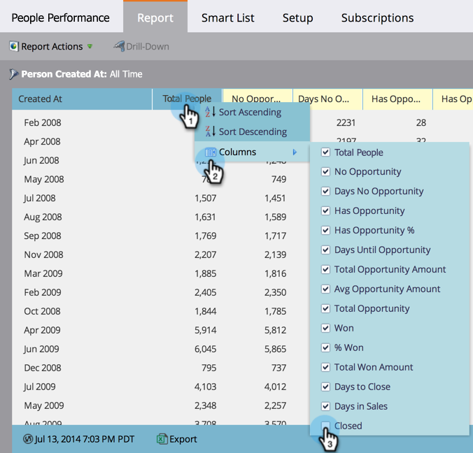

# Añadir columnas de oportunidad a un informe de posible cliente {#add-opportunity-columns-to-a-lead-report}

Para ver las estadísticas de oportunidades en los informes de personas, puede añadir columnas de oportunidades.

1. Vaya al área **[!UICONTROL Actividades de marketing]**.

   

1. Seleccione el informe en el árbol de navegación y haga clic en la ficha **[!UICONTROL Configuración]**.

   

1. Haga doble clic en **[!UICONTROL Columnas de oportunidad]**.

   

1. Seleccione **[!UICONTROL Mostrado]** del menú desplegable.

   

1. Haga clic en la ficha **[!UICONTROL Informe]** para ver el informe con las métricas de oportunidad.

   

   >[!TIP]
   >
   >Desplácese a la derecha para ver más columnas.

1. Para [agregar o quitar columnas del informe](/help/marketo/product-docs/reporting/basic-reporting/editing-reports/select-report-columns.md), haga clic en cualquier encabezado de columna y seleccione **[!UICONTROL Columnas]**.

   

   Las columnas de oportunidad disponibles son:

   >[!NOTE]
   >
   >Cada oportunidad se cuenta solo una vez, según el contacto principal asignado a ella.

   | Columna | Descripción |
   |---|---|
   | [!UICONTROL Sin oportunidad] | Cantidad de personas que *no* son un contacto de oportunidad principal. |
   | [!UICONTROL Días sin oportunidad] | Edad promedio, en días, de las personas que *no son* un contacto principal. |
   | [!UICONTROL Tiene una oportunidad] | Número de personas que son un contacto de oportunidad principal. |
   | [!UICONTROL Tiene una oportunidad %] | Porcentaje de personas que son un contacto de oportunidad principal. |
   | [!UICONTROL Días Hasta La Oportunidad] | Promedio de días para la conversión de persona a contacto de oportunidad principal. |
   | [!UICONTROL Importe total de la oportunidad] | Suma de todos los importes de oportunidad. |
   | [!UICONTROL Importe medio de oportunidad] | Suma de las cantidades de oportunidad, divididas por el número de oportunidades. |
   | [!UICONTROL Oportunidad total] | Número de todas las oportunidades. |
   | [!UICONTROL Cerrado] | Número de oportunidades que se han cerrado, ganado o perdido. |
   | [!UICONTROL Ganó] | Número de oportunidades que se han ganado. |
   | [!UICONTROL % ganó] | Porcentaje de oportunidades que se han ganado. |
   | [!UICONTROL Importe total ganado] | Suma de los importes de oportunidad ganados. |
   | [!UICONTROL días para cerrar] | Promedio de días para cerrar oportunidades. |
   | [!UICONTROL Días en ventas] | Longitud promedio del ciclo de ventas (días hasta la oportunidad + días para cerrar). |

   >[!MORELIKETHIS]
   >
   >Aprenda a [administrar el tamaño de su informe](/help/marketo/product-docs/reporting/basic-reporting/editing-reports/configure-report-size.md).
