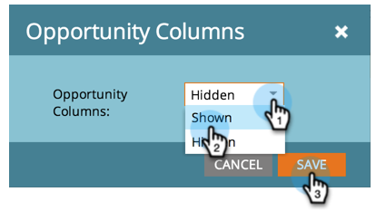

# Agregar columnas de oportunidad a un informe de posible cliente {#add-opportunity-columns-to-a-lead-report}

Para ver las estadísticas sobre las oportunidades en los informes de persona, puede agregar columnas de oportunidad.

1. Vaya a la **Actividades de marketing** .

   

1. Seleccione el informe en el árbol de navegación y haga clic en el botón **Configuración** pestaña .

   

1. Hacer doble clic **Columnas de oportunidad**.

   

1. Select **Mostrado** en el menú desplegable.

   

1. Haga clic en el **Informe** para ver el informe con métricas de oportunidad.

   

   >[!TIP]
   >
   >Desplácese a la derecha para ver más columnas.

1. Hasta [agregar o quitar columnas del informe](/help/marketo/product-docs/reporting/basic-reporting/editing-reports/select-report-columns.md), haga clic en cualquier encabezado de columna y seleccione **Columnas**.

   

   Las columnas de oportunidad disponibles son:

   >[!NOTE]
   >
   >Cada oportunidad se cuenta solo una vez, según el contacto principal asignado.

   | Columna | Descripción |
   |---|---|
   | Sin oportunidad | Número de personas que *not* un contacto de oportunidad principal. |
   | Días sin oportunidad | Edad media, en días, de las personas que *not* un contacto principal. |
   | Tiene una oportunidad | Número de personas que son un contacto de oportunidad principal. |
   | Tiene una oportunidad % | Porcentaje de personas que son un contacto de oportunidad principal. |
   | Días hasta la oportunidad | Cantidad media de días para la conversión de persona a contacto de oportunidad principal. |
   | Monto total de la oportunidad | Suma de todas las cantidades de oportunidad. |
   | Cantidad promedio de oportunidad | Suma de las cantidades de oportunidad, dividido por el número de oportunidades. |
   | Oportunidad total | Número de todas las oportunidades. |
   | Cerrado | Número de oportunidades que se han cerrado, ganado o perdido. |
   | Ganado | Número de oportunidades que se han ganado. |
   | % Ganado | Porcentaje de oportunidades ganadas. |
   | Cantidad total ganada | Suma de las cantidades de oportunidad ganadas. |
   | Días para cerrar | Cantidad media de días para cerrar oportunidades. |
   | Días de ventas | Longitud promedio del ciclo de ventas (Días hasta la oportunidad + Días hasta el cierre). |

   >[!MORELIKETHIS]
   >
   >Obtenga información sobre cómo [administrar el tamaño del informe](/help/marketo/product-docs/reporting/basic-reporting/editing-reports/configure-report-size.md).
