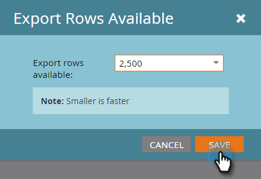

# Configurar el tamaño del informe {#configure-report-size}

De forma predeterminada, los informes de Marketo están limitados a un máximo de 5000 filas, pero puede cambiar ese límite.

1. Vaya al área **[!UICONTROL Actividades de marketing]**.

   

1. Seleccione el informe en el árbol de navegación y haga clic en la ficha **[!UICONTROL Configuración]**.

   

1. Haga doble clic en **[!UICONTROL Exportar filas disponibles]**.

   

1. Seleccione el nuevo límite.

   

   >[!TIP]
   >
   >Al cambiar el límite, se cambia el tamaño del informe en sí, no solo el archivo [!DNL Excel] exportado, de modo que si el informe tarda demasiado en generarse, reduzca el límite.

1. Haga clic en **[!UICONTROL Guardar]** para confirmar el nuevo límite.

   

   ¡Ya terminaste! El informe respetará el nuevo límite.

   >[!MORELIKETHIS]
   >
   >Puedes [exportar tu informe](/help/marketo/product-docs/reporting/basic-reporting/report-activity/export-a-report-to-excel.md) con el nuevo límite.
