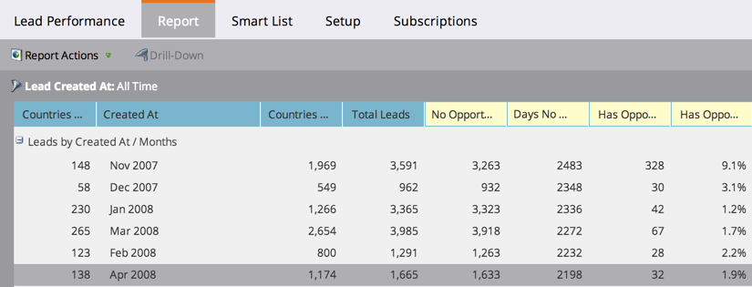

# Reordenar columnas de informes {#reorder-report-columns}

Puede cambiar el orden de las columnas en un informe.

1. Vaya al área **Actividades de marketing** (o **Análisis**).

   

1. Seleccione el informe en el árbol de navegación y haga clic en la ficha **Informe**.

   

1. Haga clic y mantenga presionada la columna para arrastrarla a la nueva posición y, a continuación, suelte el botón del ratón.

   

1. ¡Eso es todo! Las columnas aparecen ahora en el nuevo orden.

   

   Puede repetir estos pasos hasta que las columnas aparezcan en el orden que mejor se adapte a sus necesidades.

   >[!MORELIKETHIS]
   >
   >
   >    
   >    
   >    * [Seleccionar columnas del informe](select-report-columns.md)

   >[!NOTE]
   >
   >**Buceo profundo**
   >
   >
   >Conozca todo el poder de trabajar con informes en [Sistema de informes básico](https://docs.marketo.com/display/docs/basic+reporting).

