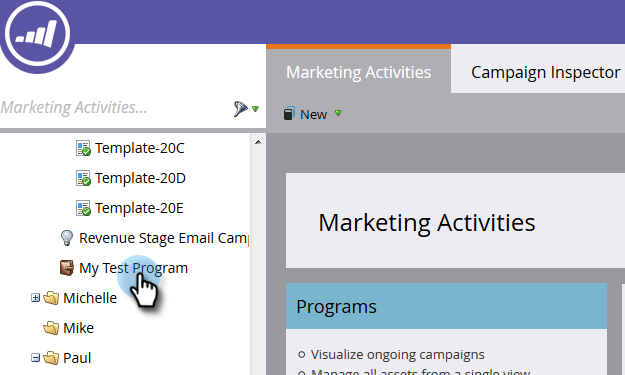
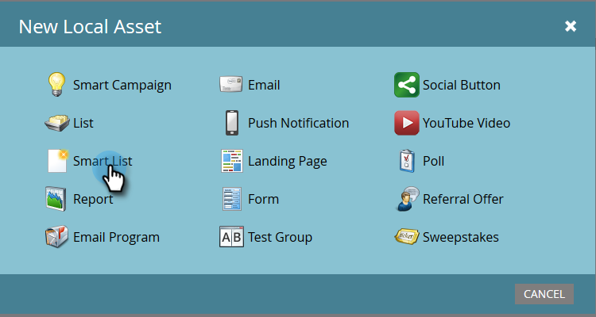
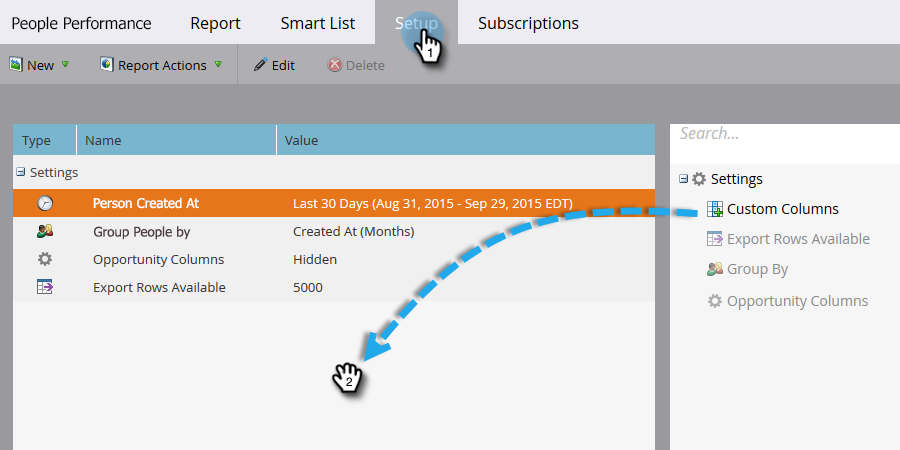

# Generar un informe de rendimiento de personas con columnas de plataforma móvil {#build-a-people-performance-report-with-mobile-platform-columns}

Siga estos pasos para crear un informe de rendimiento de personas con columnas de plataformas móviles (iOS/Android).

## Crear Listas inteligentes móviles {#create-mobile-smart-lists}

1. Vaya a **Actividades de marketing**.

   

1. Elija un programa.

   

1. En **Nuevo**, seleccione **Nuevo recurso local**.

   

1. Haga clic en **Lista inteligente**.

   

1. Escriba un nombre y haga clic en **Crear**.

   

1. Busque y arrastre el filtro Correo electrónico abierto al lienzo.

   

1. Establecer correo electrónico en **es cualquiera**.

   

1. Haga clic en **Añadir restricción** y seleccione **Plataforma**.

   

   >[!TIP]
   >
   >En este ejemplo hemos utilizado el filtro Correo electrónico abierto. También puede utilizar el filtro Correo electrónico en el que se hizo clic, ya que tiene la restricción Plataforma.

1. Establezca Platform en **iOS**.

   

   >[!NOTE]
   >
   >Al menos una persona debe haber abierto uno de sus correos electrónicos en un dispositivo iOS para que la sugerencia automática de Marketing pueda encontrarlo. Si no aparece, puede escribirlo manualmente y guardarlo.

   Ahora cree una segunda lista inteligente para la plataforma &quot;Android&quot;. Una vez que haya terminado, pase a la siguiente sección.

## Crear un informe de rendimiento de personas {#create-a-people-performance-report}

1. En Actividades de marketing, seleccione el programa que aloja sus **listas inteligentes de iOS** y **Android**.

   

1. En **Nuevo**, seleccione **Nuevo recurso local**.

   

1. Haga clic en **Informe**.

   

1. Establezca Type en **People Performance**.

   

1. Haga clic en **Crear**.

   

   ¡Estás haciendo bueno! A continuación, vaya a la siguiente sección.

## Añadir Listas inteligentes móviles como columnas {#add-mobile-smart-lists-as-columns}

1. En el informe que acaba de crear, haga clic en **Configuración** y luego arrastre **Columnas personalizadas** al lienzo.

   

   >[!NOTE]
   >
   >De forma predeterminada, el informe Rendimiento de personas está viendo los últimos 7 días. Puede cambiar el intervalo de tiempo haciendo clic en él con el doble.

1. Busque y seleccione las listas inteligentes que creó anteriormente y haga clic en **Aplicar**.

   

1. Haga clic en **Informe** para ejecutar el informe y ver los datos.

   

   Muy bien, ¿verdad? ¡Bien hecho!
